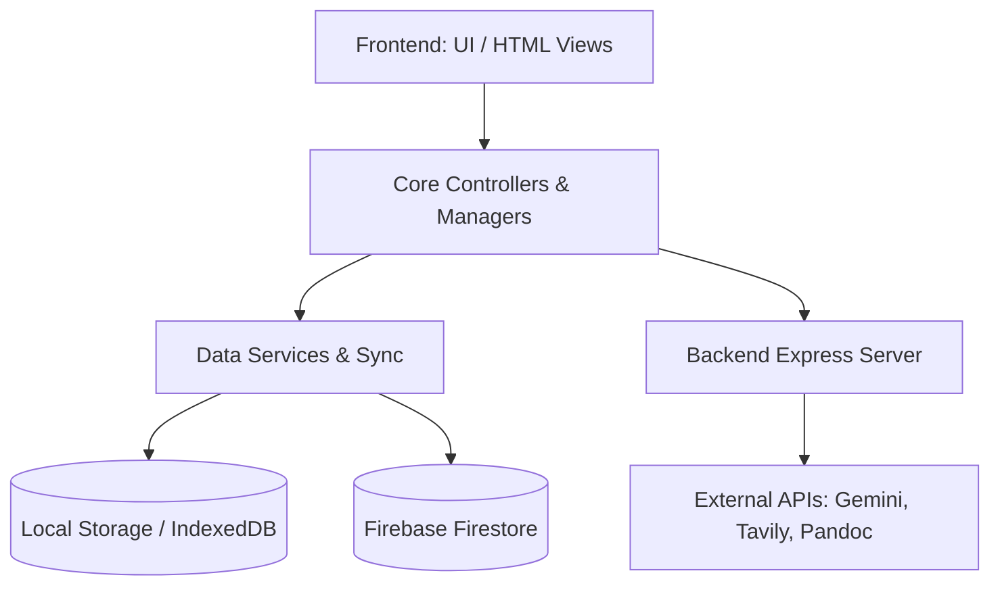

# GPAce Architectural Breakdown & Mind Map

This document serves as a comprehensive architectural mind map of the GPAce project. It details the various modules, sub-modules, and functions, providing a justification for their existence and how they connect to the rest of the application. 

## 🗺️ High-Level Architecture Overview

GPAce is a monolithic frontend application powered by vanilla JavaScript, HTML, and CSS, paired with a lightweight Node.js/Express backend for specific API tasks (like AI integration and Pandoc conversions). It utilizes Firebase for Authentication and Firestore for cloud database storage, with extensive use of local storage for offline capabilities and caching.

---

## 1. Core Services & Infrastructure

These modules form the backbone of the application, handling data persistence, authentication, and global state.

### Authentication & Firebase
* **`js/firebaseConfig.js`**
  * **Functions:** `getOrCreateFirebaseApp()`
  * **Justification:** Initializes the Firebase SDK. Required for all cloud operations. Connected to Auth, Firestore, and Sync modules.
* **`js/auth.js`**
  * **Functions:** `signInWithGoogle`, `signOutUser`, `initializeAuth`, `updateUIForUser`
  * **Justification:** Manages user sessions. Connects the UI to Firebase Authentication.

### Data Persistence & Sync
* **`js/firestore.js`** & **`js/firestore-global.js`**
  * **Functions:** `saveTasksToFirestore`, `loadTasksFromFirestore`, `mergeTaskLists`, `nukeAllTasks`, etc.
  * **Justification:** Acts as the primary data layer between the client and Firebase. Handles CRUD operations for tasks, subjects, marks, and settings.
* **`js/data-sync-manager.js`** & **`js/data-sync-integration.js`**
  * **Functions:** `initializeDataSync`, `initializeSync`
  * **Justification:** Orchestrates data synchronization between local storage and Firestore to ensure offline capabilities and cross-device consistency.
* **`js/cross-tab-sync.js`**
  * **Justification:** Uses `BroadcastChannel` or `localStorage` events to keep multiple tabs in sync if the user has GPAce open in multiple windows.
* **`js/services/SecureStorage.js`** & **`js/storageManager.js`**
  * **Justification:** Wrappers around `localStorage` and `IndexedDB` to handle sensitive data (like API keys) and manage storage quotas.

### Global State & Utilities
* **`js/core/globals.js`**
  * **Functions:** `registerGlobal`, `getGlobal`, `hasGlobal`
  * **Justification:** A registry for singleton managers and services to prevent circular dependencies and allow loose coupling between modules.
* **`js/utils/Logger.js`**, **`js/utils/Validators.js`**, **`js/utils/Sanitizer.js`**
  * **Justification:** Common utility classes used across the entire application for debugging, input validation, and XSS prevention (`escapeHtml`).

---

## 2. Task & Priority Management

The core productivity engine of GPAce.

* **`js/priority-calculator.js`** & **`js/priority-worker-wrapper.js`**
  * **Justification:** Offloads heavy priority calculations to Web Workers (`workers/worker.js`) so the main UI thread doesn't freeze when calculating priorities for hundreds of tasks.
* **`js/priority-list-utils.js`** & **`js/priority-list-sorting.js`**
  * **Functions:** `getAllTasks`, `groupTasksByInterleaveDate`, `generateSubtasks`, `navigateTask`
  * **Justification:** Handles the complex rendering and sorting logic of the task list, including grouping by dates and interleaving tasks for spaced repetition.
* **`js/core/TaskRepository.js`** & **`js/services/TaskService.js`**
  * **Justification:** The central source of truth for task state. Connects the UI layers (`TaskDisplayController`) to the persistence layer (`firestore.js`).
* **`js/taskAttachments.js`** & **`js/taskLinks.js`**
  * **Justification:** Allows users to attach files (Google Drive) and URLs to specific tasks. Connects tasks to `googleDriveApi.js`.

---

## 3. Academic Tracking (Subjects, Marks, GPA)

Modules dedicated to tracking academic performance.

* **`js/semester-management.js`** & **`js/services/SemesterService.js`**
  * **Functions:** `getCurrentSemester`, `createNewSemester`, `archiveSemester`, `migrateToSemesterSystem`
  * **Justification:** Manages academic terms. Allows users to switch between semesters and copy templates.
* **`js/subject-management.js`**
  * **Functions:** `createSubjectForms`, `updateRelativeScores`, `syncAcademicPerformanceWithMarks`
  * **Justification:** Manages the list of subjects within a semester and calculates their relative weightages.
* **`js/subject-marks.js`** & **`js/subject-marks-ui.js`**
  * **Functions:** `addSubjectMark`, `updateSubjectPerformance`, `renderSubjectList`
  * **Justification:** Tracks individual assessments (exams, quizzes) and feeds data into the GPA Predictor.
* **`js/gpa-predictor.js`**
  * **Justification:** Calculates the projected GPA based on current marks and subject weightages.

---

## 4. Grind Mode & Pomodoro (Focus Systems)

The deep work environment.

* **`js/controllers/GrindController.js`**
  * **Functions:** `toggle`, `toggleWorkspace`, `update`
  * **Justification:** Manages the state of the "Grind" interface, hiding distractions and focusing on a single task.
* **`js/pomodoroTimer.js`**
  * **Functions:** `playAudioOnce`, `stopSoundLoop`
  * **Justification:** The core timer logic (25/5 intervals). Connects to `soundManager.js` for audio cues.
* **`js/energyHologram.js`** & **`js/energyLevels.js`**
  * **Justification:** A gamified UI element that visualizes the user's "energy" based on tasks completed and Pomodoros finished.
* **`js/simulation-enhancer.js`**
  * **Justification:** Adds visual or auditory background simulations to enhance focus.

---

## 5. Flashcards & Spaced Repetition

* **`js/flashcardManager.js`** & **`js/flashcards.js`**
  * **Functions:** `loadDecks`, `startStudySession`, `flipCard`, `rateCard`
  * **Justification:** Handles the CRUD operations for flashcard decks and the UI for study sessions.
* **`js/sm2.js`**
  * **Justification:** The implementation of the SuperMemo-2 (SM-2) spaced repetition algorithm. Calculates the optimal next review date based on user confidence ratings.
* **`js/flashcardTaskIntegration.js`**
  * **Justification:** Connects specific flashcard decks to upcoming tasks or exams, auto-generating study reminders.

---

## 6. Workspace & Document Editor

A built-in rich text editor for notes and assignments.

* **`js/workspace-core.js`**
  * **Functions:** `initQuillEditor`, `startAutoSave`, `handleKeyboardShortcuts`
  * **Justification:** Initializes the Quill.js editor (or similar) and handles the core typing and saving mechanics.
* **`js/workspace-document.js`**, **`js/workspace-formatting.js`**, **`js/workspace-media.js`**
  * **Justification:** Sub-modules for handling specific editor tasks: file I/O (Export to PDF/Word via `pandoc_converter.py`), text formatting, and image uploading/resizing.

---

## 7. AI & External Integrations

* **`js/ai-researcher.js`** & **`js/gemini-api.js`**
  * **Functions:** `performAISearch`, `processPdf`, `generateSimulation`, `extractPdfText`
  * **Justification:** Interacts with the local Node backend and the Gemini API to provide intelligent search, summarize PDFs, and generate content.
* **`js/speech-recognition.js`** & **`js/speech-synthesis.js`**
  * **Justification:** Utilizes the Web Speech API to allow voice commands and text-to-speech for accessibility and hands-free study.
* **`js/todoistIntegration.js`**
  * **Justification:** Two-way sync with Todoist, allowing users to import tasks from their existing task manager.

---

## 8. Backend API (`server.js`)

* **`server.js`**
  * **Functions:** Express routing, static file serving, `TavilyClient` initialization, `server.listen`.
  * **Justification:** Serves the frontend assets, acts as a proxy to avoid CORS issues with external APIs (like Gemini/Tavily), handles file uploads, and interfaces with Python scripts for complex processing.

---

## ⚠️ Unjustified & Disconnected Files

Based on the architectural analysis, the following files and directories appear to be disconnected, experimental, or redundant:

1. **`Youtube Searcher (Not Completed)/` (Directory)**
   * **Status:** Incomplete feature.
   * **Recommendation:** Move to an `_archived` folder or delete until ready for active development.
2. **`Crush Assignment/` (Directory)**
   * **Status:** Unclear scope. Seems isolated from the core `js/` architecture.
   * **Recommendation:** Review if this is a standalone experiment or intended to be merged into `workspace-core.js`.
3. **`test-worker.js`**
   * **Status:** Likely a test file used during the development of the Web Worker priority system.
   * **Recommendation:** Remove from production builds.
4. **`pandoc-fallback.js` vs `pandoc_converter.py`**
   * **Status:** Potential redundancy. The backend utilizes `pandoc_converter.py` for document conversion, but a frontend fallback exists. 
   * **Recommendation:** Ensure they aren't conflicting. If the Python script is the primary engine, the JS fallback might be dead code.
5. **`js/marks-tracking.js` vs `js/subject-marks.js`**
   * **Status:** Overlapping responsibilities. Both appear to handle mark tracking.
   * **Recommendation:** Consolidate into a single module to prevent state conflicts.
6. **`_archived/` (Directory)**
   * **Status:** Safe to ignore for production, but should be removed from the deployment pipeline to reduce bundle size.
