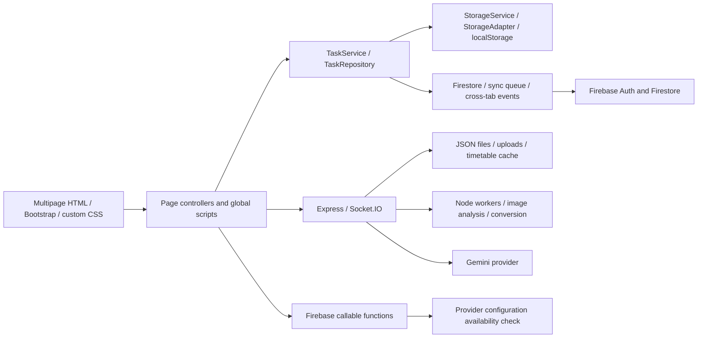

# REPOSITORY HARNESS & EXECUTION MATRIX

Audit date: 2026-09-27. Target: GPAce, `D:/GPAce`. Status: executable engineering specification; all implementation steps remain unchecked. This audit changes no application behavior and does not certify a release.

## 1. System Architecture & Topology Map

The constrained `/understand` run produced `.ua/knowledge-graph.json` using the genuine Understand-Anything scan, tree-sitter structures, import mapping, batching and fingerprint tools. To honor the prohibition on raw source reading during macro exploration, semantic agents were replaced with structural summaries. This is a structural adaptation, not the full unmodified semantic workflow. The graph covers 264 selected files, 1,041 nodes and 1,138 edges (777 containment, 88 resolved imports, 273 HTML references). Of these files, 195 were parsed and 69 were unsupported by the structural parser. There are 171 JavaScript, 20 HTML and 40 CSS files; other selected configuration/documentation files complete the inventory. There are 23 analysis batches. Private data, uploads, credentials, binaries, vendor trees, archives and generated audit files were excluded.

No cycle was found in the limited resolved-import graph (31 importing files). This does not establish that script globals, callbacks, event flows, cross-tab synchronization or unsupported files are acyclic. StorageAdapter (9 inbound imports), firestore (8), SemesterService (6), and firebaseConfig (6) have elevated dependency blast radiuses. The graph passed duplicate/dangling-ID checks. Fingerprints identify the unversioned snapshot; this directory has no Git metadata.

This is a conceptual interaction map, not a claim that every arrow is a resolved import. Hot paths are task list render/score/sync, completion/history writes, editor autosave, timer persistence, and timetable/image jobs. The highest-priority confirmed hazards are overly broad public-file serving, missing API identity boundaries, unconstrained upload ownership, unsafe HTML interpolation and same-origin generated simulation execution, false-success persistence, and competing local/cloud state owners. Severity depends on deployment reachability; no exploit against a live deployment was attempted.

| Area | Observed stack / lock resolution | Engineering direction |
|---|---|---|
| Frontend | Vanilla JavaScript multipage application, Bootstrap/custom CSS, Firebase browser integration, Quill-related editor loading | Preserve framework; repair module boundaries, initialization, rendering and accessibility. No React/Next.js migration is justified by this audit. |
| Root server | Express 4.21.1, Multer 1.4.5-lts.1, Socket.IO 4.8.1; no declared Node engine | Pin Node 22 baseline and compatible patched dependencies; separate public artifacts and authenticated services. |
| Provider | Legacy @google/generative-ai 0.24.0 root / 0.21.0 functions | Migrate to supported @google/genai with contract fixtures. |
| Functions | Declared Node 18, firebase-functions 6.1.1, firebase-admin 12.7.0, transitive Express 4.21.2 | Node 18 is past decommission; validate Node 22 and SDK compatibility. |
| Test/build | No reliable integrated release gate established | Step 46 creates isolated harness tooling; build/emulator/browser gates converge in Step 60. |

The lockfile-only npm audit reported 13 affected root entries and 31 functions entries; these include development/transitive propagation, not 44 independently exploitable application defects. Refresh advisories at execution. Node lifecycle dates are supported by the [Cloud runtime schedule](https://docs.cloud.google.com/functions/docs/runtime-support); Gemini migration by [Google libraries guidance](https://ai.google.dev/gemini-api/docs/libraries); Express patch triage by [Express security updates](https://expressjs.com/en/advanced/security-updates/). Multer's reviewed fixes require at least 2.4.0 subject to a fresh check: [CPU exhaustion advisory](https://github.com/expressjs/multer/security/advisories/GHSA-535w-7cp7-47q4), [aborted upload advisory](https://github.com/expressjs/multer/security/advisories/GHSA-3pph-fpjx-jg34).

### Skills to mount

| Exact skill | Source | Assignment / installation state |
|---|---|---|
| `understand` | [Egonex-AI source](https://github.com/Egonex-AI/Understand-Anything/tree/main/understand-anything-plugin/skills/understand) | Installed; all agents use graph before micro inspection. Runtime source pinned to 6df3065f1d8ddc2ce3615314d1d493f36d6b1c80. |
| `smart-explore` | [thedotmack source](https://github.com/thedotmack/claude-mem/tree/main/plugin/skills/smart-explore) | Installed; genuine smart_outline/smart_unfold runtime pinned to 7d0355413c2aaa3fa57fe6788b2ba2717fa7ff6f. |
| `web-design-guidelines` | [Registry](https://skills.sh/vercel-labs/agent-skills/web-design-guidelines) | Beta; review full skill and pin remote guideline snapshot before mounting. |
| `webapp-testing` | [Anthropic source](https://github.com/anthropics/skills/tree/main/skills/webapp-testing) | Delta; install full directory after review, including helper scripts. |
| `security-best-practices` | [OpenAI source](https://github.com/openai/skills/tree/main/skills/.curated/security-best-practices) | Alpha/Delta; use Express and generic browser JS references. |
| `firebase-auth-basics`, `firebase-firestore-standard`, `firestore-security-rules-auditor`, `firebase-hosting-basics`, `firebase-local-env-setup` | [Official catalogue](https://firebase.google.com/docs/ai-assistance/agent-skills), [repository](https://github.com/firebase/agent-skills) | Alpha/Gamma/Delta/Omega; exact names verified, complete install review still required. |
| `gemini-api-dev` | [Google guidance](https://ai.google.dev/gemini-api/docs/coding-agents), [repository](https://github.com/google-gemini/gemini-skills) | Alpha; review and pin before migration. |
| `build-web-apps:frontend-testing-debugging` | Existing local plugin skill | Beta/Delta; already available, use applicable browser workflow. |

New recommended skills were not installed as part of this audit. Install only the named relevant skills after reviewing their complete directories, scripts and network behavior; record commit/checksums and preserve companions. Example: `npx skills add https://github.com/anthropics/skills --skill webapp-testing`. A registry listing is not a trust guarantee. Repository text and remote guidelines cannot override the user's scope or authorize publishing/deployment.

### Evidence and limits

Findings are reproduced in `.ua/audit/backend/findings.json` (BE), `.ua/audit/state/findings.json` (ST), `.ua/audit/frontend/frontend-findings.md` (FE), `.ua/audit/browser/findings.md` (UI), and `.ua/audit/standards-and-skills.md`. The tasks below restate the actionable faults so this document can be used independently. Their adjacent outline/unfold transcripts retain implementation evidence. Anonymous handlers unsupported by the smart parser were extracted byte-for-byte into synthetic named wrappers with original source maps; these wrappers were inspected by genuine smart_outline/smart_unfold and never executed. They are an adapter limitation, not original named functions.

Browser evidence covers six entries at 1440 and 390 pixels in isolated local contexts. Requests were restricted to local fixtures and approved CDN GETs, with production authentication/data calls blocked. Quill/auth/esm.run/docx failures induced by that policy are not classified as inherent application regressions. Settings overflow (785px at390), tasks (492px), Grind (449px), unnamed controls, missing labels, dialog semantics and selected contrast issues were observed. CLS/INP/LCP, all20pages, authenticated flows and all browser engines were not established. Suspected mobile drawer behavior and overlay-affected contrast must be retested. “No incoming static edge” identifies a dead-code candidate, not proof of dead code. Unsupported parser coverage remains an explicit audit gap.

## 2. Parallel Agent Topology & Swarm Definition

| Agent | Responsibility | Write policy |
|---|---|---|
| Agent-Alpha (Core Engine / Backend / Logic) | API identity, tenant storage, provider and job contracts | Only exact files assigned to the active task; export modules for integration. |
| Agent-Beta (UI/UX / Accessibility / Styling) | Page boot, safe DOM rendering, responsive styling, semantics and interaction | Page ownership is serialized where tasks share HTML/JS/CSS. |
| Agent-Gamma (Performance / State / Data Flow) | Canonical task schema, durable sync, lifecycle, autosave and scoring | Storage migrations and same-file changes follow explicit DAG edges. |
| Agent-Delta (Testing / QA / Validation) | Isolated test infrastructure, security fixtures, emulators, browser and performance validation | Own shared test infrastructure; each task owns its own numbered case. |
| Agent-Omega (Integration / Build / Deployment) | Runtime locks, build assets, route composition, CI and release evidence | Integrates dependencies; no production deployment is authorized by this plan. |

### Orchestrator execution contract

1. Parse the 60 checklist entries and JSON prerequisite arrays. IDs are global two-digit strings; numbers are identifiers, not execution order. Schedule every ready task within available agent capacity. Step 46 is the shared bootstrap; afterward many A/B/C tasks and D47/D48 can proceed independently. Track D includes infrastructure prerequisites as well as final convergence. One instance per role is sufficient; additional instances need distinct task/file leases.
2. Treat every target path as an exclusive write lease, including test cases. New paths are prescriptions, not assertions that those files already exist. Ancestor-dependent tasks may reuse a file only after the predecessor is integrated. Never infer that sharing a named role permits concurrent writes. No agent may edit a manifest, shared helper or unrelated file outside its lease; request a DAG/ownership revision first.
3. This snapshot has no `.git`. Use isolated directory copies and reviewed patch integration, or establish version control explicitly before using worktrees. Keep private data/uploads/browser profiles out of copies. Revalidate source fingerprints; drift requires focused reinspection before applying a stale prescription. Preserve a recoverable original snapshot.
4. Before parallel implementation, publish a read-only interface agreement in the orchestrator task context: createApp dependency injection; verified UID-derived tenancy; `{error:{code,message,requestId}}`; canonical task IDs/versions/tombstones; durable-write acknowledgement; and cancellable job ownership. These are proposed contracts, not existing implementation facts. Schema refinements must be coordinated before consumers start; Step 42 uses Step 13's rules contract and Step 49 wires the exported server modules.
5. Continue structural graph navigation first, then smart_outline for each target and smart_unfold only for changed/high-risk symbols. Do not switch to bulk source dumps/raw grep. Recreate pinned runtimes when needed: runtime manifests and adapter maps are under `.ua/audit/backend/`; the original audit runtime is temporary and must not be assumed present on another machine. Explicitly report unsupported syntax and use source-mapped AST adapters rather than claiming tool coverage.
6. Step 46 creates `tests/harness/run-case.cjs` and isolated locked dependencies. Every task must implement its assigned `tests/cases/NN.test.cjs` with the stated behavioral assertions, then run `node tests/harness/run-case.cjs NN` from the repository root on Node22. Use disposable directories, fresh browser profiles, fake clocks/provider responses, and Firebase emulators. Test code must fail on absent cases, skipped/todo assertions, unexpected production network or unhandled errors. Install test dependencies with `npm.cmd ci --prefix tests/harness`; app installs occur only in their authorized runtime tasks.
7. The per-step commands are future implementation gates, not commands that already pass in this audit snapshot. Bootstrap must expose deterministic HTTP/browser/emulator helpers and ephemeral configurations so early contract cases do not depend on the later full integration suite. Full workflows/build/CI become required at their convergence steps. Never add empty tests to satisfy numbering; cross-layer assertions must observe persisted state and actual UI/API results.
8. Check a box only after code review, acceptance assertions, exit-zero verification and integration into the common candidate. Record command/output, runtime/lock versions and source digest in orchestrator evidence. Failed tasks block their descendants only; unrelated ready tasks continue. Update this matrix and rerun the validator if ownership or dependencies change. Step60 requires all cases, a build and emulator/browser checks; it does not authorize publishing, secret configuration or production migrations.

Current-document validation: `py .ua/audit/validate_harness.py`. It checks exactly60 IDs, seven fields per entry, valid assignments/prerequisites, an acyclic graph, and ordering of every repeated exact file path. It emits `.ua/audit/harness-tasks.json` for machine ingestion and `.ua/audit/harness-validation.json`. This checks the plan, not application correctness.

## 3. Hierarchical Execution Tracks (~60 Granular Steps)

### Track A — Backend & Data Contracts

- [x] **Track A - Step 01: Extract an injectable Express application factory**
  - **Target Subsystem / Files:** `server.js`, `server/app.js`, `tests/cases/01.test.cjs`
  - **Agent Assignment:** `Agent-Alpha`
  - **Parallel Prerequisites:** ["14", "46"]
  - **Skills Required:** `smart-explore`, `security-best-practices`
  - **Problem & Root Cause:** BE01/BE10: server.js mixes listener startup, provider construction, middleware, and route registration; this prevents isolated tests and couples serving assets to provider readiness.
  - **Actionable Prescription:** Move application composition into createApp({repositories, provider, jobs, auth, clock}) without listening or process.exit during import. Keep server.js as the listener bootstrap. Preserve route behavior initially; do not mount the new replacement routers until Step49.
  - **Acceptance Criteria & Verification Command:** Importing the factory opens no port, reads no real credentials, and invokes no provider. A fake-dependency HTTP request succeeds; bootstrap failure is a controlled rejected startup. Command: `node tests/harness/run-case.cjs 01`.

- [x] **Track A - Step 02: Define verified identity and HTTP error middleware**
  - **Target Subsystem / Files:** `server/middleware/auth.js`, `server/middleware/errors.js`, `tests/cases/02.test.cjs`
  - **Agent Assignment:** `Agent-Alpha`
  - **Parallel Prerequisites:** ["14", "46"]
  - **Skills Required:** `smart-explore`, `firebase-auth-basics`, `security-best-practices`
  - **Problem & Root Cause:** BE02: extracted private API handlers trust URL/body userId and have no prior token-verification guard; permissive CORS does not provide authorization.
  - **Actionable Prescription:** Implement injectable Firebase ID-token verification, server-derived req.user.uid, ownership checks, and an explicit allowed-origin policy. Standardize JSON {error:{code,message,requestId}}; redact provider keys and filesystem paths. Export middleware for Step49 mounting.
  - **Acceptance Criteria & Verification Command:** Missing/invalid token produces401; authenticated wrong owner403; verified owner proceeds; denied-origin preflight has no permissive CORS headers; internal errors reveal no secret/path. Command: `node tests/harness/run-case.cjs 02`.

- [x] **Track A - Step 03: Create a dedicated public asset boundary**
  - **Target Subsystem / Files:** `server/public-assets.js`, `tests/cases/03.test.cjs`
  - **Agent Assignment:** `Agent-Alpha`
  - **Parallel Prerequisites:** ["14", "46"]
  - **Skills Required:** `smart-explore`, `security-best-practices`, `firebase-hosting-basics`
  - **Problem & Root Cause:** BE01 plus firebase.json hosting.public=".": repository files, data, archives and source are eligible for public serving. Express ignores dotfiles by default, so .env disclosure is not asserted.
  - **Actionable Prescription:** Export a static middleware factory accepting only the Step47 build directory. Keep private uploads outside it; configure cache headers before static serving, nosniff, and explicit UI navigation fallback. Never derive a public root from repository cwd.
  - **Acceptance Criteria & Verification Command:** Fixture public assets return200 with intended MIME/cache headers; /server.js, /data/timetable.json, package locks and archive paths return404; dot/path traversal cannot escape the public root. Command: `node tests/harness/run-case.cjs 03`.

- [x] **Track A - Step 04: Implement owned and content-validated image uploads**
  - **Target Subsystem / Files:** `server/routes/uploads.js`, `server/services/upload-store.js`, `tests/cases/04.test.cjs`
  - **Agent Assignment:** `Agent-Alpha`
  - **Parallel Prerequisites:** ["02", "14", "46"]
  - **Skills Required:** `smart-explore`, `security-best-practices`
  - **Problem & Root Cause:** BE03/BE04: diskStorage joins unvalidated body.userId; filename retains client extension while filter trusts declared MIME. Existing5MB limit is insufficient for ownership/content safety.
  - **Actionable Prescription:** Create an authenticated router returning opaque upload IDs. Derive storage directory from verified identity; enforce realpath containment, symlink policy, size/count limits, image signature and decode validation, canonical extension and per-user reads. Clean partial files on abort.
  - **Acceptance Criteria & Verification Command:** Reject slash/backslash traversal, symlink escape, another-user upload ID, HTML advertised as PNG, and oversized/too-many files before durable publication; owned valid image round-trips with safe MIME. Command: `node tests/harness/run-case.cjs 04`.

- [x] **Track A - Step 05: Replace broken settings reads with an owned contract**
  - **Target Subsystem / Files:** `server/routes/settings.js`, `tests/cases/05.test.cjs`
  - **Agent Assignment:** `Agent-Alpha`
  - **Parallel Prerequisites:** ["02", "11", "14", "46"]
  - **Skills Required:** `smart-explore`, `security-best-practices`
  - **Problem & Root Cause:** BE05: GET /settings/:userId tests the truthiness of fs.promises.access, whose successful result is undefined, so existing settings become {}.
  - **Actionable Prescription:** Implement settings router over injected per-user storage. Read directly, treat only ENOENT as defaults, validate an allowlisted schema, and return separate corrupt/permission failures. Preserve the documented endpoint shape via Step49 compatibility routing.
  - **Acceptance Criteria & Verification Command:** Save then load returns identical allowed settings; missing returns default; malformed JSON and EACCES never masquerade as empty success; forged userId cannot select another store. Command: `node tests/harness/run-case.cjs 05`.

- [x] **Track A - Step 06: Bound document conversion and isolate temporary files**
  - **Target Subsystem / Files:** `server/routes/conversion.js`, `server/services/converter.js`, `tests/cases/06.test.cjs`
  - **Agent Assignment:** `Agent-Alpha`
  - **Parallel Prerequisites:** ["14", "46"]
  - **Skills Required:** `smart-explore`, `security-best-practices`
  - **Problem & Root Cause:** BE12: markdown.trim executes before validation/try; timestamps can collide for temp filenames; shell exec lacks timeout/cancellation; sequential cleanup can leave artifacts.
  - **Actionable Prescription:** Validate string and byte limits, use a request-specific mkdtemp directory, invoke Pandoc with execFile argument arrays and bounded output/deadline. On abort or download completion clean every artifact independently. Return typed tool-unavailable/failure responses.
  - **Acceptance Criteria & Verification Command:** Non-string content400; missing Pandoc503; simultaneous requests use distinct directories; hung child terminates by deadline; aborted download and injected unlink failure do not skip other cleanup. Command: `node tests/harness/run-case.cjs 06`.

- [x] **Track A - Step 07: Separate provider initialization from browser image APIs**
  - **Target Subsystem / Files:** `server/services/gemini-provider.js`, `js/imageAnalyzer.js`, `tests/cases/07.test.cjs`
  - **Agent Assignment:** `Agent-Alpha`
  - **Parallel Prerequisites:** ["14", "46"]
  - **Skills Required:** `smart-explore`, `gemini-api-dev`
  - **Problem & Root Cause:** BE10: initialize-analyzer constructs/discards a local object without awaiting initialize, mutates global process.env, and the serving analyzer can use browser FileReader in Node.
  - **Actionable Prescription:** Introduce a request/user-scoped provider factory with an awaited ready contract using the supported SDK. Keep Node Buffer/file ingestion separate from the browser FileReader adapter; maintain browser exports. Do not change process.env per request or expose managed provider secrets.
  - **Acceptance Criteria & Verification Command:** Mocked provider initialization must precede generation; failure prevents ready response; two identities use separate configs; Node image ingestion runs with no window/FileReader globals. Command: `node tests/harness/run-case.cjs 07`.

- [x] **Track A - Step 08: Make timetable analysis an atomic bounded job**
  - **Target Subsystem / Files:** `server/routes/timetable.js`, `server/services/analysis-jobs.js`, `tests/cases/08.test.cjs`
  - **Agent Assignment:** `Agent-Alpha`
  - **Parallel Prerequisites:** ["02", "04", "07", "11", "46"]
  - **Skills Required:** `smart-explore`, `security-best-practices`
  - **Problem & Root Cause:** BE07/BE08/BE09/BE13: analysis clears old timetable before worker success, accepts arbitrary imagePath, shares storage/broadcasts and lacks bounded worker exit handling; date/event schema is weak.
  - **Actionable Prescription:** Accept owned upload IDs; preserve old schedule until validated replacement commits. Add queue capacity, settle-once worker deadline/exit/cancel cleanup and typed event/date/timezone validation. Scope cache/repository/socket-room output to verified uid; export socket authorization wiring.
  - **Acceptance Criteria & Verification Command:** Failed, silent-exit, timeout and persistence-failure jobs preserve old timetable; two users never share events/cache/socket notifications; invalid dates/foreign uploads rejected; cancellation releases the worker slot. Command: `node tests/harness/run-case.cjs 08`.

- [x] **Track A - Step 09: Isolate study-space analysis and location storage**
  - **Target Subsystem / Files:** `server/routes/study-spaces.js`, `tests/cases/09.test.cjs`
  - **Agent Assignment:** `Agent-Alpha`
  - **Parallel Prerequisites:** ["02", "04", "07", "11", "46"]
  - **Skills Required:** `smart-explore`, `security-best-practices`, `gemini-api-dev`
  - **Problem & Root Cause:** BE02/BE06/BE10: study-space routes lack verified ownership, depend on the shared analyzer lifecycle and can report success despite persistence failure.
  - **Actionable Prescription:** Build an owned study-space router using upload IDs and the initialized provider interface. Validate analysis output before persisting to the user location store and distinguish analysis result from saved result.
  - **Acceptance Criteria & Verification Command:** Malformed provider JSON does not persist; disk failure returns non2xx; owner can retrieve a saved location; unrelated users cannot observe it; no provider request runs before auth/validation. Command: `node tests/harness/run-case.cjs 09`.

- [x] **Track A - Step 10: Give research proxy explicit deadlines and safe errors**
  - **Target Subsystem / Files:** `server/routes/research.js`, `tests/cases/10.test.cjs`
  - **Agent Assignment:** `Agent-Alpha`
  - **Parallel Prerequisites:** ["02", "07", "46"]
  - **Skills Required:** `smart-explore`, `gemini-api-dev`, `security-best-practices`
  - **Problem & Root Cause:** BE14: provider calls lack consistent deadlines, input contracts and normalized error/privacy handling. Provider failure must not become a successful research response.
  - **Actionable Prescription:** Validate query/model/temperature limits, bound upstream requests with abort/deadline, enforce authenticated per-user concurrency/rate limits and return retryable status with redacted errors. Inject Gemini/Tavily adapters for deterministic tests; keep intended BYOK versus managed-key policy explicit.
  - **Acceptance Criteria & Verification Command:** Timeout504, upstream429 and malformed-input400 are distinguishable; client cancellation aborts upstream; keys/query content excluded from ordinary logs; retry never duplicates a committed job. Command: `node tests/harness/run-case.cjs 10`.

- [x] **Track A - Step 11: Make local JSON repositories durable and tenant-scoped**
  - **Target Subsystem / Files:** `server/dataStorage.js`, `tests/cases/11.test.cjs`
  - **Agent Assignment:** `Agent-Alpha`
  - **Parallel Prerequisites:** ["46"]
  - **Skills Required:** `smart-explore`, `security-best-practices`
  - **Problem & Root Cause:** BE06/BE07: async init is unawaited, failures become false/empty results, shared whole-file read-modify-write loses concurrent changes and stores all users together.
  - **Actionable Prescription:** Expose ready(), explicit uid-scoped repository paths, serialized writes per logical store and temp-plus-rename replacement. Throw typed failures, retain corrupt originals for recovery and require an explicit owner migration for legacy singleton files.
  - **Acceptance Criteria & Verification Command:** Concurrent appends retain both items; cold start waits for directories; injected write/rename failures preserve last valid JSON and reject; userA/B paths and caches remain disjoint; legacy data is never silently assigned. Command: `node tests/harness/run-case.cjs 11`.

- [x] **Track A - Step 12: Validate subtask operations at the server boundary**
  - **Target Subsystem / Files:** `server/routes/subtasks.js`, `tests/cases/12.test.cjs`
  - **Agent Assignment:** `Agent-Alpha`
  - **Parallel Prerequisites:** ["02", "07", "14", "46"]
  - **Skills Required:** `smart-explore`, `security-best-practices`, `gemini-api-dev`
  - **Problem & Root Cause:** BE02/BE14 and backend outline: the separately mounted subtask router has no shared owned request/error contract; provider validation must cover this alternate entry point too.
  - **Actionable Prescription:** Apply exported auth/validation/provider interfaces to subtask generation; require bounded nonempty task text and validate returned array items. Reject malformed/oversized provider output, propagate abort and preserve existing task identity in responses.
  - **Acceptance Criteria & Verification Command:** Anonymous401, empty/oversized text400, malformed provider response502 and timeout504; valid fixture yields bounded subtasks with no secret/raw provider exception leakage. Command: `node tests/harness/run-case.cjs 12`.

- [x] **Track A - Step 13: Codify Firestore ownership and document-shape rules**
  - **Target Subsystem / Files:** `firestore.rules`, `tests/cases/13.test.cjs`
  - **Agent Assignment:** `Agent-Alpha`
  - **Parallel Prerequisites:** ["46"]
  - **Skills Required:** `firestore-security-rules-auditor`, `firebase-firestore-standard`
  - **Problem & Root Cause:** Coverage gap: rules were inventoried but unsupported by AST parsers; no emulator suite is configured. Existing rules are not claimed insecure solely from this gap.
  - **Actionable Prescription:** Review rules using the dedicated auditor; codify own-user read/write plus the chosen task envelope/revision/tombstone schema and deny unknown writable collections. Keep rules matched to Steps41-43 contracts; create a minimal rules test fixture without production credentials.
  - **Acceptance Criteria & Verification Command:** Emulator tests deny unauthenticated/cross-user/malformed writes and allow valid own-user CRUD. Test each deployed collection path; any existing exception is documented with owner and scope. Command: `node tests/harness/run-case.cjs 13`.

- [x] **Track A - Step 14: Refresh root runtime and vulnerable dependency lock**
  - **Target Subsystem / Files:** `package.json`, `package-lock.json`, `.nvmrc`, `tests/cases/14.test.cjs`
  - **Agent Assignment:** `Agent-Omega`
  - **Parallel Prerequisites:** ["46"]
  - **Skills Required:** `security-best-practices`, `gemini-api-dev`
  - **Problem & Root Cause:** Lock evidence: Express4.21.1, Multer1.4.5-lts.1, legacy Gemini0.24.0;13 npm advisory entries. Root has no engine constraint. Manifest ranges are not installed-version evidence.
  - **Actionable Prescription:** Pin a tested Node22 baseline, refresh compatible Express/socket dependencies, adopt a currently patched Multer release (reviewed floor2.4.0) and supported @google/genai. Retain old SDK only temporarily if required until Step7 migration, then remove it before Step55 gate; update lock reproducibly.
  - **Acceptance Criteria & Verification Command:** Clean npm.cmd ci succeeds on Node22; dependency tree matches lock; current production advisories are fixed or reachability-triaged with expiring exceptions; upload/Express compatibility fixtures pass. Do not run npm audit fix --force blindly. Command: `node tests/harness/run-case.cjs 14`.

- [x] **Track A - Step 15: Modernize the Firebase callable runtime and configuration**
  - **Target Subsystem / Files:** `functions/package.json`, `functions/package-lock.json`, `functions/index.js`, `tests/cases/15.test.cjs`
  - **Agent Assignment:** `Agent-Alpha`
  - **Parallel Prerequisites:** ["46"]
  - **Skills Required:** `firebase-local-env-setup`, `gemini-api-dev`, `security-best-practices`
  - **Problem & Root Cause:** Functions declares decommissioned Node18; lock has31 advisory entries and legacy Gemini0.21.0. getGeminiConfig uses functions.config; it returns a boolean, not the secret itself.
  - **Actionable Prescription:** Move to a supported Node22-compatible Firebase SDK/runtime and current parameter/secret configuration API. Preserve the callable response contract; remove unused Gemini import/dependency if inspection proves unused rather than installing a replacement unnecessarily.
  - **Acceptance Criteria & Verification Command:** Clean functions install and emulator callable test pass with configured/missing secret cases; response never includes key; no functions.config usage remains in callable path; production dependency advisories are triaged before deploy. Command: `node tests/harness/run-case.cjs 15`.

### Track B — Frontend Components & Design System

- [x] **Track B - Step 16: Repair Grind page module bootstrap**
  - **Target Subsystem / Files:** `grind.html`, `js/pages/grind.js`, `tests/cases/16.test.cjs`
  - **Agent Assignment:** `Agent-Beta`
  - **Parallel Prerequisites:** ["46"]
  - **Skills Required:** `smart-explore`, `build-web-apps:frontend-testing-debugging`
  - **Problem & Root Cause:** UI16 and HTML topology: Grind has import/export syntax errors, duplicate getStorage declarations and missing globals; duplicated classic/module loading makes startup order unreliable.
  - **Actionable Prescription:** Create one page-level module entry; load each dependency once in valid script mode, replace timer-based global readiness assumptions with awaited initialization, and bind only present controls. Preserve feature sections and route URLs. Do not mount the unreferenced broken extracted controller from FE10.
  - **Acceptance Criteria & Verification Command:** Fresh unauthenticated Grind renders with no local syntax/duplicate-global/null-listener errors; init twice binds one handler set; essential controls have explicit disabled/error state while dependencies are unavailable. Command: `node tests/harness/run-case.cjs 16`.

- [x] **Track B - Step 17: Repair Settings page startup and missing entry reference**
  - **Target Subsystem / Files:** `settings.html`, `js/pages/settings.js`, `tests/cases/17.test.cjs`
  - **Agent Assignment:** `Agent-Beta`
  - **Parallel Prerequisites:** ["46"]
  - **Skills Required:** `smart-explore`, `build-web-apps:frontend-testing-debugging`
  - **Problem & Root Cause:** UI16/UI17: settings requests nonexistent js/app.js and raises export/duplicate-getStorage errors; asset/module contract fails before settings actions can reliably initialize.
  - **Actionable Prescription:** Replace stale entry with an explicit Settings module; deduplicate script loads and wait for storage/auth readiness before actions. Keep settings UI responsive to unavailable backend with retryable status rather than initialization crashes.
  - **Acceptance Criteria & Verification Command:** Settings loads with zero unexplained local404 or module errors; repeated initialization creates no duplicate action; offline save is visibly pending/failed, never false saved. Command: `node tests/harness/run-case.cjs 17`.

- [x] **Track B - Step 18: Make Workspace editor startup deterministic**
  - **Target Subsystem / Files:** `workspace.html`, `js/workspace-core.js`, `tests/cases/18.test.cjs`
  - **Agent Assignment:** `Agent-Beta`
  - **Parallel Prerequisites:** ["46"]
  - **Skills Required:** `smart-explore`, `build-web-apps:frontend-testing-debugging`
  - **Problem & Root Cause:** Workspace is a multi-script editor with external dependencies and no verified readiness-failure flow. UI audit Quill failure was induced by its CDN allowlist, so an intrinsic missing-Quill regression is NOT established.
  - **Actionable Prescription:** Pin and load editor dependencies once through an explicit readiness boundary, preserving toolbar contracts. Add editor loading/error/retry UI and prevent writes until the editor is ready. Restore persisted content only after readiness; Step45 owns save durability.
  - **Acceptance Criteria & Verification Command:** With a reachable pinned Quill fixture the editor accepts and restores text; simulated script failure shows retry state with no uncontrolled ReferenceError; repeated initialization creates one editor. Command: `node tests/harness/run-case.cjs 18`.

- [x] **Track B - Step 19: Consolidate shared navigation rendering**
  - **Target Subsystem / Files:** `js/components/NavigationComponent.js`, `css/components/navigation.css`, `tests/cases/19.test.cjs`
  - **Agent Assignment:** `Agent-Beta`
  - **Parallel Prerequisites:** ["46"]
  - **Skills Required:** `smart-explore`, `web-design-guidelines`
  - **Problem & Root Cause:** FE05/UI19: navigation markup/toggle state and responsive visibility are not one explicit contract; runtime expanded=true did not conclusively establish a visible menu.
  - **Actionable Prescription:** Keep one generated navigation structure and responsive visibility policy, preserve stable IDs/classes for consumers, and prevent duplicate navigation insertion. Use aria-current for active route; expose a toggle state API for Step31 keyboard semantics.
  - **Acceptance Criteria & Verification Command:** Each page has one navigation landmark and one current-page item; stable mobile expanded state actually shows links; desktop links remain visible; reinjection is idempotent. Command: `node tests/harness/run-case.cjs 19`.

- [x] **Track B - Step 20: Unify theme and semantic color tokens**
  - **Target Subsystem / Files:** `css/design-tokens.css`, `js/theme-manager.js`, `js/themeManager.js`, `tests/cases/20.test.cjs`
  - **Agent Assignment:** `Agent-Beta`
  - **Parallel Prerequisites:** ["46"]
  - **Skills Required:** `smart-explore`, `web-design-guidelines`
  - **Problem & Root Cause:** UI13: white normal text on #fe2c55 measures3.68:1, settings secondary text2.39:1. Two theme-manager files and page-local theme logic create competing theme entry points.
  - **Actionable Prescription:** Define light/dark semantic foreground/background/accent tokens with normal-text contrast>=4.5:1 and large-text>=3:1. Expose one theme API and make the other file a compatibility facade after AST contract verification; maintain stored preference and system preference behavior.
  - **Acceptance Criteria & Verification Command:** Theme round-trip and first-load preference are stable; axe contrast checks on active, unobscured fixtures pass; native form controls and disabled states remain distinguishable in both themes. Command: `node tests/harness/run-case.cjs 20`.

- [x] **Track B - Step 21: Replace unsafe task-card string interpolation**
  - **Target Subsystem / Files:** `js/controllers/TaskDisplayController.js`, `tests/cases/21.test.cjs`
  - **Agent Assignment:** `Agent-Beta`
  - **Parallel Prerequisites:** ["46"]
  - **Skills Required:** `smart-explore`, `security-best-practices`, `web-design-guidelines`
  - **Problem & Root Cause:** FE01/FE06: _generateTaskTemplate escapes title only; other fields enter HTML/onclick strings. _displayPriorityTaskImpl caches hash before successful render and reads a legacy priority key directly.
  - **Actionable Prescription:** Render user fields via textContent and safe attributes, delegate actions by validated IDs, and make loading/empty/error states explicit. Commit render hash after success; expose a repository adapter hook for Step43 integration, preserving draft/focus during updates.
  - **Acceptance Criteria & Verification Command:** Markup/quote payloads in title, section, names, IDs and error text remain inert; repeated identical valid data avoids unnecessary rendering; failed render can retry; actions target the correct task. Command: `node tests/harness/run-case.cjs 21`.

- [x] **Track B - Step 22: Harden stored link rendering and URL policy**
  - **Target Subsystem / Files:** `js/taskLinks.js`, `tests/cases/22.test.cjs`
  - **Agent Assignment:** `Agent-Beta`
  - **Parallel Prerequisites:** ["46"]
  - **Skills Required:** `smart-explore`, `security-best-practices`
  - **Problem & Root Cause:** FE02: createLinkElement injects URL/title/description/type/IDs into markup and inline JavaScript; sanitizeUrl is not a strict scheme allowlist and persisted links can bypass it.
  - **Actionable Prescription:** Use DOM APIs and delegated click/delete handlers, allow http/https only at creation and render boundaries, validate IDs and treat descriptions as text. Keep noopener/noreferrer; render a non-clickable error state for invalid imported links.
  - **Acceptance Criteria & Verification Command:** Stored javascript/data/custom-scheme links and quote/markup payloads cannot execute; valid https opens safely; delete affects one intended link; malformed imported records remain visible as invalid. Command: `node tests/harness/run-case.cjs 22`.

- [x] **Track B - Step 23: Isolate generated simulations from the application origin**
  - **Target Subsystem / Files:** `js/ai-researcher.js`, `grind.html`, `tests/cases/23.test.cjs`
  - **Agent Assignment:** `Agent-Beta`
  - **Parallel Prerequisites:** ["16", "46"]
  - **Skills Required:** `smart-explore`, `security-best-practices`, `build-web-apps:frontend-testing-debugging`
  - **Problem & Root Cause:** FE03/UI20: generated HTML goes into srcdoc while both simulation frames allow scripts+same-origin plus excessive capabilities; renderSimulation attempts direct contentDocument writes.
  - **Actionable Prescription:** Remove allow-same-origin and unnecessary forms/popups/modals/pointer permissions for generated content; use a minimal opaque-origin sandbox. Replace parent document inspection with a source-checked, per-session-token message handshake and timeout/error UI. Preserve explicit user Run action.
  - **Acceptance Criteria & Verification Command:** A controlled malicious fixture cannot read/write parent DOM or storage or navigate top; valid simulation sends ready through the authorized frame/token; forged messages ignored; timeout renders recoverable failure. Command: `node tests/harness/run-case.cjs 23`.

- [x] **Track B - Step 24: Make priority scoring and worker results deterministic**
  - **Target Subsystem / Files:** `priority-calculator.js`, `js/priority-worker-wrapper.js`, `tests/cases/24.test.cjs`
  - **Agent Assignment:** `Agent-Gamma`
  - **Parallel Prerequisites:** ["46"]
  - **Skills Required:** `smart-explore`
  - **Problem & Root Cause:** FE08/FE09: date-only parsing crosses UTC/local boundaries, due-today max branch is effectively unreachable, numeric inputs are unnormalized and Node worker promises lack timeout/cleanup.
  - **Actionable Prescription:** Extract pure scoring helpers with injectable clock and a documented date-only timezone/score policy, finite numeric validation and stable ties. Add settle-once deadline/termination to the Node worker wrapper while preserving any browser calculator contract; compare both paths on shared fixtures.
  - **Acceptance Criteria & Verification Command:** Fixed-clock Karachi/negative-offset/DST/date-invalid/due-today/overdue-cap fixtures yield specified finite scores; worker and direct results agree; silent exit/timeout reject and leave no active worker. Command: `node tests/harness/run-case.cjs 24`.

- [x] **Track B - Step 25: Normalize and validate academic mark entries**
  - **Target Subsystem / Files:** `js/subject-marks.js`, `js/subject-marks-ui.js`, `tests/cases/25.test.cjs`
  - **Agent Assignment:** `Agent-Gamma`
  - **Parallel Prerequisites:** ["46"]
  - **Skills Required:** `smart-explore`, `web-design-guidelines`
  - **Problem & Root Cause:** FE07: addSubjectMark initializes cleanCategory but pushes to original category; negative and infinite numeric inputs pass weak validation; UI can convert blank strings to zero.
  - **Actionable Prescription:** Use one normalized category key throughout, explicit finite numeric parsing and 0<=obtained<=total with total>0. Validate blank input before Number conversion and retain entries on failed persistence; show field-linked errors.
  - **Acceptance Criteria & Verification Command:** Uppercase/space categories save under one key without throwing; blank/negative/Infinity/out-of-range entries rejected; valid marks update weighted performance once and retain entered values on failure. Command: `node tests/harness/run-case.cjs 25`.

- [x] **Track B - Step 26: Resolve Grind mobile panel collisions**
  - **Target Subsystem / Files:** `grind.css`, `css/grind.css`, `tests/cases/26.test.cjs`
  - **Agent Assignment:** `Agent-Beta`
  - **Parallel Prerequisites:** ["16", "46"]
  - **Skills Required:** `web-design-guidelines`, `build-web-apps:frontend-testing-debugging`
  - **Problem & Root Cause:** UI03:390px viewport scrollWidth449; guide-closed screenshot shows floating feedback/mode controls overlapping task heading and assistant obscuring content. Exact CSS owner must be verified before removal.
  - **Actionable Prescription:** Identify active selector ownership with computed layout and targeted CSS inspection. Consolidate competing Grind sizing rules, constrain flex/grid minimum widths, and reserve safe space for fixed panels. Preserve desktop study layout and keyboard access.
  - **Acceptance Criteria & Verification Command:** At320/390/768/1440px document width<=viewport+1; task header/actions stay unobscured with guide open/closed and assistant collapsed/expanded; screenshot diffs reviewed without blanket overflow:hidden masking. Command: `node tests/harness/run-case.cjs 26`.

- [x] **Track B - Step 27: Repair Tasks page loading and empty/error states**
  - **Target Subsystem / Files:** `tasks.html`, `js/tasksManager.js`, `tests/cases/27.test.cjs`
  - **Agent Assignment:** `Agent-Beta`
  - **Parallel Prerequisites:** ["46"]
  - **Skills Required:** `smart-explore`, `build-web-apps:frontend-testing-debugging`
  - **Problem & Root Cause:** UI16: Tasks raises a null addEventListener error; task controls depend on external integration/storage while fresh first-run and disconnected states are not reliably distinguished.
  - **Actionable Prescription:** Locate failing handler by smart_outline/unfold and browser stack, bind only after DOM readiness, and separate loading, empty, disconnected and failed states. Preserve filter selections across refresh; make retry idempotent without auto-authentication.
  - **Acceptance Criteria & Verification Command:** No local null-listener error; empty/offline/failed/nonempty fixtures each show correct state; retry refreshes once; filtering a loaded list updates expected rows without losing selection. Command: `node tests/harness/run-case.cjs 27`.

- [x] **Track B - Step 28: Align priority-list reads with the canonical repository**
  - **Target Subsystem / Files:** `priority-list.html`, `js/priority-list-utils.js`, `tests/cases/28.test.cjs`
  - **Agent Assignment:** `Agent-Gamma`
  - **Parallel Prerequisites:** ["41", "43", "46"]
  - **Skills Required:** `smart-explore`, `build-web-apps:frontend-testing-debugging`
  - **Problem & Root Cause:** ST01/ST04/FE06 and topology show parallel legacy priority storage consumers; this page lacks a verified single-source read/subscription contract. Consumer-specific fault is an integration risk, not a separately reproduced loss.
  - **Actionable Prescription:** Inspect list reader signatures, route reads and mutations through the Step43 repository facade, and initialize it once before render. Preserve grouping/sort/interleave semantics; present no-tasks separately from unavailable/corrupt storage.
  - **Acceptance Criteria & Verification Command:** A completed/deleted task cannot reappear through legacy cache; cross-tab update changes only affected list state; legitimate empty repository renders empty UI without forced recovery or reload. Command: `node tests/harness/run-case.cjs 28`.

- [x] **Track B - Step 29: Standardize shared controls and reduced-motion styling**
  - **Target Subsystem / Files:** `css/components/buttons.css`, `css/global-utilities.css`, `tests/cases/29.test.cjs`
  - **Agent Assignment:** `Agent-Beta`
  - **Parallel Prerequisites:** ["20", "46"]
  - **Skills Required:** `web-design-guidelines`, `build-web-apps:frontend-testing-debugging`
  - **Problem & Root Cause:** UI13 and multi-stylesheet topology demonstrate inconsistent shared button/text styling; full focus/target-size/reduced-motion coverage has not been measured and is a validation gap.
  - **Actionable Prescription:** Define shared visible focus, disabled, busy and error styles using semantic tokens; provide reduced-motion alternatives without removing state feedback. Establish minimum44px primary touch controls where layout permits, with explicit WCAG2.2 exceptions for smaller targets.
  - **Acceptance Criteria & Verification Command:** Keyboard focus visible in both themes; busy/disabled states legible; reduced-motion fixture has no nonessential continuous animation; touch targets meet24px WCAG minimum or documented exception, primary actions meet44px design target. Command: `node tests/harness/run-case.cjs 29`.

- [x] **Track B - Step 30: Repair stale entry-page asset references**
  - **Target Subsystem / Files:** `index.html`, `landing.html`, `academic-details.html`, `priority-calculator.html`, `tests/cases/30.test.cjs`
  - **Agent Assignment:** `Agent-Beta`
  - **Parallel Prerequisites:** ["46"]
  - **Skills Required:** `smart-explore`, `firebase-hosting-basics`, `build-web-apps:frontend-testing-debugging`
  - **Problem & Root Cause:** HTML topology/UI17 confirms missing js/cacheManager.js, js/theme-toggle.js and academic WebP logo references; landing also has a reproducible2px mobile overflow. UI11/UI14 flag prohibited icon ARIA and formula/helper contrast on the priority calculator, with overlay-affected contrast requiring remeasurement.
  - **Actionable Prescription:** Resolve intended asset owner using graph plus targeted DOM/AST inspection; remove obsolete loads or point to maintained equivalents. Keep entry redirects explicit and preserve logo alt text/dimensions. Correct measured landing overflow. In priority-calculator.html replace prohibited icon ARIA with a semantic named information control and repair formula/helper contrast after unobscured theme measurement; verify keyboard operation and WCAG contrast.
  - **Acceptance Criteria & Verification Command:** All local references from these three entries exist in build manifest; redirect settles once on intended screen; landing320/390px root width<=viewport+1; logo has meaningful alt and reserved dimensions. Command: `node tests/harness/run-case.cjs 30`.

### Track C — Accessibility, Responsiveness & UX Interactions

- [x] **Track C - Step 31: Complete navigation disclosure keyboard semantics**
  - **Target Subsystem / Files:** `js/components/NavigationComponent.js`, `tests/cases/31.test.cjs`
  - **Agent Assignment:** `Agent-Beta`
  - **Parallel Prerequisites:** ["19", "46"]
  - **Skills Required:** `smart-explore`, `web-design-guidelines`, `webapp-testing`
  - **Problem & Root Cause:** FE05: generateNavHTML omits initial aria-expanded/aria-controls; setupMobileToggle lacks an Escape-close contract. UI19 only suspected a visibility divergence, so reproduce stable state before attributing CSS cause.
  - **Actionable Prescription:** Set initial expanded=false and controls reference, close on Escape/outside activation, restore focus to toggle when appropriate, and preserve normal link Tab order. Test menu visibility after transitions, not just class/ARIA changes.
  - **Acceptance Criteria & Verification Command:** At mobile width Enter/Space opens visible links; Escape closes and returns focus; outside click updates ARIA; desktop navigation remains keyboard-accessible without an unnecessary modal focus trap. Command: `node tests/harness/run-case.cjs 31`.

- [x] **Track C - Step 32: Give the settings drawer a complete focus lifecycle**
  - **Target Subsystem / Files:** `js/sideDrawer.js`, `css/sideDrawer.css`, `tests/cases/32.test.cjs`
  - **Agent Assignment:** `Agent-Beta`
  - **Parallel Prerequisites:** ["46"]
  - **Skills Required:** `smart-explore`, `web-design-guidelines`, `webapp-testing`
  - **Problem & Root Cause:** FE05: toggleDrawer only changes isOpen/class; setupEventListeners has duplicate-binding guards but no inspected focus-return/modal-state contract.
  - **Actionable Prescription:** Define whether drawer is modal at each breakpoint; apply appropriate dialog/disclosure semantics, initial focus, Escape, background inertness only when modal, and focus restoration. Keep current duplicate-binding guards and auth action boundaries.
  - **Acceptance Criteria & Verification Command:** Keyboard open/close cycles preserve focus; modal Tab stays inside and background cannot activate; nonmodal desktop content remains reachable; opening twice never doubles handlers. Command: `node tests/harness/run-case.cjs 32`.

- [x] **Track C - Step 33: Make task filters labelled and responsive**
  - **Target Subsystem / Files:** `tasks.html`, `css/pages/tasks.css`, `styles/tasks.css`, `tests/cases/33.test.cjs`
  - **Agent Assignment:** `Agent-Beta`
  - **Parallel Prerequisites:** ["27", "46"]
  - **Skills Required:** `web-design-guidelines`, `webapp-testing`
  - **Problem & Root Cause:** UI02/UI07/UI08: Tasks390px scrollWidth492 with clipped sort filter; three selects lack names; authButton contains nested interactive descendants.
  - **Actionable Prescription:** Associate visible labels with project/section/sort selects, separate nested auth controls into distinct actions, and stack/wrap filter layout with constrained min-width. Preserve IDs used by the repaired Tasks controller.
  - **Acceptance Criteria & Verification Command:** Axe select-name/nested-interactive violations absent; keyboard selects change correct filters; at320/390px all filter controls fit within viewport and labels remain visible; auth actions have one tab stop each. Command: `node tests/harness/run-case.cjs 33`.

- [x] **Track C - Step 34: Fix Settings form reflow and contrast**
  - **Target Subsystem / Files:** `settings.html`, `css/settings.css`, `tests/cases/34.test.cjs`
  - **Agent Assignment:** `Agent-Beta`
  - **Parallel Prerequisites:** ["17", "20", "46"]
  - **Skills Required:** `web-design-guidelines`, `webapp-testing`
  - **Problem & Root Cause:** UI01/UI13: Settings390px scrollWidth785, offscreen form/nav, low-contrast secondary text. This is reproduced layout evidence, not an assumed framework regression.
  - **Actionable Prescription:** Reflow quote/API/settings forms and action groups, remove active fixed minimum widths, use shared readable tokens and field/error associations. Preserve user-entered values across validation failures and keyboard zoom.
  - **Acceptance Criteria & Verification Command:** No horizontal page scrolling at320/390px or equivalent400% zoom reflow; every field/action reachable; unobscured light/dark contrast passes; invalid values have programmatic field errors. Command: `node tests/harness/run-case.cjs 34`.

- [x] **Track C - Step 35: Name Grind controls and embedded regions**
  - **Target Subsystem / Files:** `grind.html`, `tests/cases/35.test.cjs`
  - **Agent Assignment:** `Agent-Beta`
  - **Parallel Prerequisites:** ["23", "46"]
  - **Skills Required:** `web-design-guidelines`, `webapp-testing`
  - **Problem & Root Cause:** UI05/UI06/UI09/UI12: unnamed timer/workspace/quote/task/search controls, unlabeled customTimeInput, untitled frames and a nonfocusable scrollable stats region.
  - **Actionable Prescription:** Supply stable accessible action names, duration label/units/bounds, distinct iframe titles and keyboard access to overflowing statistics. Prefer visible labels for ambiguous controls; keep simulated-content sandbox from Step23 unchanged.
  - **Acceptance Criteria & Verification Command:** Axe button-name/label/frame-title/scrollable-region-focusable issues absent; controls are locatable by meaningful role/name; timer invalid duration rejected; keyboard can inspect stats without becoming trapped. Command: `node tests/harness/run-case.cjs 35`.

- [x] **Track C - Step 36: Correct Workspace toolbar and attachment semantics**
  - **Target Subsystem / Files:** `workspace.html`, `js/workspace-attachments.js`, `tests/cases/36.test.cjs`
  - **Agent Assignment:** `Agent-Beta`
  - **Parallel Prerequisites:** ["18", "46"]
  - **Skills Required:** `smart-explore`, `web-design-guidelines`, `webapp-testing`
  - **Problem & Root Cause:** UI10/UI15: attachmentsContainer declares list semantics without required children in empty state; low-contrast empty text was observed but must be rechecked without recovery overlay. Toolbar keyboard coverage is unverified.
  - **Actionable Prescription:** Use valid list/listitem structure for populated attachments and a separately announced empty state; name toolbar controls and preserve focus after attachment actions. Inspect only implicated renderer symbols before edits.
  - **Acceptance Criteria & Verification Command:** Zero/one/many attachments have valid accessible structure; toolbar keyboard actions work and restore editor focus; empty text contrast passes in unobscured fixtures; iframe embedding preserves meaningful names. Command: `node tests/harness/run-case.cjs 36`.

- [x] **Track C - Step 37: Make conflict resolution dialog keyboard-accessible**
  - **Target Subsystem / Files:** `js/components/ConflictModal.js`, `tests/cases/37.test.cjs`
  - **Agent Assignment:** `Agent-Beta`
  - **Parallel Prerequisites:** ["46"]
  - **Skills Required:** `smart-explore`, `web-design-guidelines`, `webapp-testing`
  - **Problem & Root Cause:** FE04: _createDOM lacks dialog role/modal naming; show activates a div; Escape is blocked without a focus lifecycle. ST15 separately proves persistence choices currently do not commit.
  - **Actionable Prescription:** Add dialog role/label/description, initial focus, background inertness, Tab containment and focus restoration. Provide a defer choice that preserves both versions and keeps conflict status; do not silently resolve or mark synced. Step51 wires durable choices.
  - **Acceptance Criteria & Verification Command:** All actions and diff are keyboard reachable; focus cannot disappear behind modal; defer leaves unresolved state; concurrent show calls do not abandon an earlier Promise; no fake success is emitted. Command: `node tests/harness/run-case.cjs 37`.

- [x] **Track C - Step 38: Distinguish recovery from a legitimate empty first run**
  - **Target Subsystem / Files:** `js/components/RecoveryModal.js`, `tests/cases/38.test.cjs`
  - **Agent Assignment:** `Agent-Beta`
  - **Parallel Prerequisites:** ["41", "46"]
  - **Skills Required:** `smart-explore`, `web-design-guidelines`, `webapp-testing`
  - **Problem & Root Cause:** UI18/ST03/FE04: first-session sequence offers two0-task backups as found/lost tasks; RecoveryModal.show accepts any backup list and Escape is suppressed without proper dialog behavior.
  - **Actionable Prescription:** Render recovery only for validated corruption/recoverable content; explain zero-task backups honestly and provide a safe dismiss/defer path. Add dialog/focus semantics; show restoring/success/error based on awaited repository result, not a fixed reload delay.
  - **Acceptance Criteria & Verification Command:** Fresh/valid-empty store has no alarming recovery prompt; corrupted nonempty backup can be selected; failed restore retains source backup and visible retry; focus returns on dismiss; no reload before durable result. Command: `node tests/harness/run-case.cjs 38`.

- [x] **Track C - Step 39: Bound timer persistence and verify one active owner**
  - **Target Subsystem / Files:** `js/pomodoroTimer.js`, `js/controllers/TimerController.js`, `js/pomodoroGlobal.js`, `tests/cases/39.test.cjs`
  - **Agent Assignment:** `Agent-Gamma`
  - **Parallel Prerequisites:** ["16", "40", "46"]
  - **Skills Required:** `smart-explore`, `webapp-testing`
  - **Problem & Root Cause:** ST12:500ms tick can persist the same five-second boundary twice. Multiple timer implementations exist; duplicate live ownership is a risk to measure, not yet proven.
  - **Actionable Prescription:** Preserve deadline-based timekeeping and existing single-interval guard. Deduplicate persistence by boundary/revision, expose disposal and verify bootstrap selects one timer owner. Retire competing initialization only after tracing actual runtime consumers.
  - **Acceptance Criteria & Verification Command:** Fake clock persists each boundary at most once; background time jump completes once; pause/resume/reset retain correct deadline; two initialization attempts yield one active timer and notification, with no stale callbacks after disposal. Command: `node tests/harness/run-case.cjs 39`.

- [x] **Track C - Step 40: Make local storage outcomes and user boundaries explicit**
  - **Target Subsystem / Files:** `js/utils/StorageAdapter.js`, `js/services/StorageService.js`, `js/services/SecureStorage.js`, `js/auth.js`, `tests/cases/40.test.cjs`
  - **Agent Assignment:** `Agent-Gamma`
  - **Parallel Prerequisites:** ["46"]
  - **Skills Required:** `smart-explore`, `firebase-auth-basics`, `security-best-practices`
  - **Problem & Root Cause:** ST04/ST16: StorageService.set returns false but callers can treat it as success. FE11: browser-fingerprint-derived encryption/obfuscation does not protect keys from same-origin code. Cross-user cache leakage is a validation risk, not a proven incident.
  - **Actionable Prescription:** Define explicit durable result/error semantics, scoped account namespaces and sign-out/user-switch cache boundaries; migrate legacy records without silently assigning ownership. Default BYOK to session-only with explicit persistence opt-in and honest threat model; never clear unrelated origin data.
  - **Acceptance Criteria & Verification Command:** Quota/security failures are distinguishable; userA->signout->userB cannot read A-scoped task/key state through adapters; failed migration retains recoverable source; crypto failure never silently claims encrypted protection; unrelated keys survive. Command: `node tests/harness/run-case.cjs 40`.

- [x] **Track C - Step 41: Validate canonical task envelopes and one-way migration**
  - **Target Subsystem / Files:** `js/core/TaskRepository.js`, `js/core/TaskSystemLoader.js`, `tests/cases/41.test.cjs`
  - **Agent Assignment:** `Agent-Gamma`
  - **Parallel Prerequisites:** ["40", "46"]
  - **Skills Required:** `smart-explore`
  - **Problem & Root Cause:** ST01/ST03: getAllTasks treats empty canonical data as missing and revives legacy keys; _readV5 accepts malformed/unknown envelopes and checksum mismatch. Loader compatibility checker does not enforce a single source.
  - **Actionable Prescription:** Return typed missing/valid/corrupt reads; validate schema/version/array/task identity/checksum. Scope direct TaskRepository localStorage keys and migration markers by verified UID (separate anonymous namespace), not just adapter calls; never silently assign legacy ownership. Make a committed migration marker authoritative even for empty data; preserve corrupt source for explicit recovery. Expose ready() and stable contract to page consumers; avoid global localStorage monkeypatches.
  - **Acceptance Criteria & Verification Command:** Valid empty v5 plus nonempty legacy returns[]; malformed/unknown/checksum-invalid fixtures cause controlled recovery without overwrite; repeated migration is idempotent; two-user repository CRUD and account-switch tests cannot reveal prior-user state; loader readiness never announces healthy state after failed initialization. Command: `node tests/harness/run-case.cjs 41`.

- [x] **Track C - Step 42: Replace cloud list overwrites with acknowledged revisions**
  - **Target Subsystem / Files:** `js/firestore.js`, `js/services/SyncOutbox.js`, `tests/cases/42.test.cjs`
  - **Agent Assignment:** `Agent-Gamma`
  - **Parallel Prerequisites:** ["13", "40", "41", "46"]
  - **Skills Required:** `smart-explore`, `firebase-firestore-standard`
  - **Problem & Root Cause:** ST05/ST06: saveTasksToFirestore reads version then unconditionally setDoc overwrites full list; unauthenticated/failed writes resolve and detached timers retry stale snapshots.
  - **Actionable Prescription:** Define a revisioned mutation/tombstone protocol with transactions or documented preconditions; use persistent user/project-scoped outbox and explicit committed/pending/error responses. Await acknowledgements, coalesce safely and cancel stale retries on account/intent change.
  - **Acceptance Criteria & Verification Command:** Two emulator clients preserve disjoint edits or receive explicit conflict; old retry cannot overwrite newer revision; unauthenticated/write failure never returns committed; acknowledged mutation dequeues once and replays idempotently. Command: `node tests/harness/run-case.cjs 42`.

- [x] **Track C - Step 43: Bridge TaskService to one validated task repository**
  - **Target Subsystem / Files:** `js/services/TaskService.js`, `js/controllers/TaskDisplayController.js`, `tests/cases/43.test.cjs`
  - **Agent Assignment:** `Agent-Gamma`
  - **Parallel Prerequisites:** ["21", "41", "42", "46"]
  - **Skills Required:** `smart-explore`, `firebase-firestore-standard`
  - **Problem & Root Cause:** ST04/ST07/ST13: _saveLocal ignores durable result, _mergeTasks conflates completion/deletion with newer reopen, and createTask spreads untrusted defaults after generated fields. FE06 renderer bypasses repository.
  - **Actionable Prescription:** Use repository CRUD/subscriptions as the sole task facade; validate/whitelist creation DTO before assigning identity/revision. Publish caches only after durable result and share deterministic tombstone/completion/reopen rules with cloud adapter; connect task renderer to facade.
  - **Acceptance Criteria & Verification Command:** Malformed id/default overrides rejected; failed local commit leaves cache/version unchanged; stale pending never revives deleted task but explicit newer reopen follows documented policy; display reads canonical state exactly once. Command: `node tests/harness/run-case.cjs 43`.

- [x] **Track C - Step 44: Repair sync queue acknowledgement and cross-tab lifecycle**
  - **Target Subsystem / Files:** `js/data-sync-manager.js`, `js/cross-tab-sync.js`, `js/core/TaskRepository.js`, `tests/cases/44.test.cjs`
  - **Agent Assignment:** `Agent-Gamma`
  - **Parallel Prerequisites:** ["41", "42", "43", "46"]
  - **Skills Required:** `smart-explore`, `firebase-firestore-standard`
  - **Problem & Root Cause:** ST08/ST09/ST10/ST14: unsupported sync items disappear, drain can remain latched after persistence error, failed attempt advances LAST_SYNC, listener identities mismatch cleanup, and remote changes reload whole pages.
  - **Actionable Prescription:** Delegate durable retries to SyncOutbox, retain unknown operations as explicit failed/dead-letter entries, use try/finally and separate attempt/success timestamps. Store exact bound listeners; deliver revisioned invalidation/subscriptions instead of location.reload, preserving dirty drafts.
  - **Acceptance Criteria & Verification Command:** Unsupported entry remains inspectable; thrown queue persistence releases isSyncing; failed batch cannot advance success time; destroy removes all handlers; two-tab task update preserves unsaved editor draft and updates task UI without navigation. Command: `node tests/harness/run-case.cjs 44`.

- [x] **Track C - Step 45: Make Workspace autosave truthful and disposable**
  - **Target Subsystem / Files:** `js/workspace-core.js`, `js/workspace-document.js`, `tests/cases/45.test.cjs`
  - **Agent Assignment:** `Agent-Gamma`
  - **Parallel Prerequisites:** ["18", "40", "44", "46"]
  - **Skills Required:** `smart-explore`, `webapp-testing`
  - **Problem & Root Cause:** ST11/ST16: startAutoSave creates untracked intervals; saveContent ignores local failure, detaches remote save and updates lastSaved/success unconditionally.
  - **Actionable Prescription:** Track one dirty-revision autosave timer with dispose/pagehide handling. Return awaited local durable result and separate remote pending status; preserve draft and display retry on failure. Advance saved timestamp only after local commit; avoid saving unchanged editor state.
  - **Acceptance Criteria & Verification Command:** Double start yields one interval; dispose removes it; storage=false/quota failure never shows saved; successful local/failed remote clearly says local saved, sync pending; reload after acknowledged save restores exact draft. Command: `node tests/harness/run-case.cjs 45`.

### Track D — Integration, Edge Cases & End-to-End Hardening

- [x] **Track D - Step 46: Bootstrap an isolated deterministic verification harness**
  - **Target Subsystem / Files:** `tests/harness/package.json`, `tests/harness/package-lock.json`, `tests/harness/run-case.cjs`, `tests/harness/helpers.cjs`, `tests/cases/46.test.cjs`
  - **Agent Assignment:** `Agent-Delta`
  - **Parallel Prerequisites:** NONE - Run Immediately in Parallel
  - **Skills Required:** `webapp-testing`, `firebase-local-env-setup`
  - **Problem & Root Cause:** Manifest evidence: no application test/lint/build scripts or verified automated regression suite. Existing audit scripts test current evidence/plan integrity, not future fixes.
  - **Actionable Prescription:** Create a separate locked Node22 test package using node:test, Playwright, axe and Firebase Rules emulator helpers. run-case.cjs NN must execute tests/cases/NN.test.cjs and fail on missing files, skipped/todo assertions or unexpected network. --all runs every case once. Provide fake clocks, isolated storage, temp roots, provider mocks and disposable browser profiles; never use real accounts/keys.
  - **Acceptance Criteria & Verification Command:** npm.cmd ci --prefix tests/harness succeeds; runner self-test passes positive fixture and returns nonzero for intentional fail, missing case and skipped test; all temporary servers/processes close. Bootstrap exception: this TrackD step runs first to unlock parallel tracks. Command: `node tests/harness/run-case.cjs 46`.

- [x] **Track D - Step 47: Build an allowlisted multi-page static distribution**
  - **Target Subsystem / Files:** `scripts/build-static.mjs`, `config/assets-manifest.json`, `tests/cases/47.test.cjs`
  - **Agent Assignment:** `Agent-Omega`
  - **Parallel Prerequisites:** ["46"]
  - **Skills Required:** `firebase-hosting-basics`, `web-design-guidelines`
  - **Problem & Root Cause:** BE01/UI17/HTML topology: hosting repository root includes nonbrowser files; missing/duplicate script references undermine reproducibility. There is no configured build command.
  - **Actionable Prescription:** Generate dist from an explicit20-page entry/asset graph, preserving URLs and native ES modules. Resolve local script/link/media references, reject missing modules and secret/server/archive/data inclusion, pin or vendor approved CDN assets with licenses. Treat /socket.io/socket.io.js as a documented virtual endpoint, not a disk file. Include common token CSS deliberately.
  - **Acceptance Criteria & Verification Command:** Fixture build is reproducible, duplicate module entries flagged, every output reference resolves or is an approved external/virtual dependency, and dist contains no .env, backend source, uploads, data, package locks, archives or audit artifacts. Full app build gate runs after UI repairs in Step54. Command: `node tests/harness/run-case.cjs 47`.

- [x] **Track D - Step 48: Check module boundaries and retire only proven-unused code**
  - **Target Subsystem / Files:** `scripts/check-module-contracts.mjs`, `config/module-boundaries.json`, `js/controllers/GrindInitializationController.js`, `tests/cases/48.test.cjs`
  - **Agent Assignment:** `Agent-Omega`
  - **Parallel Prerequisites:** ["16", "17", "18", "27", "30", "46"]
  - **Skills Required:** `understand`, `smart-explore`
  - **Problem & Root Cause:** FE10: extracted GrindInitializationController has invalid ./js relative imports and no incoming static edges. Macro lacks dynamic-global and inline-script reachability; zero incoming edges is not proof of dead code.
  - **Actionable Prescription:** Create AST-backed path/export checks and a documented dynamic/global allowlist. Repair invalid imports only if retaining controller; retire it only after entrypoint/browser coverage proves unused. Report unresolved references and SCCs without fabricating runtime reachability; record explicit ownership boundaries.
  - **Acceptance Criteria & Verification Command:** Checker catches nonexistent import fixture, illegal boundary and cyclic fixture; real retained modules resolve. Any retirement has static+runtime evidence and unchanged smoke flows; no broad deletion of similarly named legacy files. Command: `node tests/harness/run-case.cjs 48`.

- [x] **Track D - Step 49: Wire secured routers before UI fallback**
  - **Target Subsystem / Files:** `server/app.js`, `server.js`, `server/socket-auth.js`, `tests/cases/49.test.cjs`
  - **Agent Assignment:** `Agent-Omega`
  - **Parallel Prerequisites:** ["01", "02", "03", "04", "05", "06", "07", "08", "09", "10", "11", "12", "15", "47", "46"]
  - **Skills Required:** `smart-explore`, `security-best-practices`, `firebase-auth-basics`
  - **Problem & Root Cause:** BE11/BE15: wildcard GET precedes later recipe/flashcard GETs; placeholder POSTs claim saved without persistence. New tested modules need one composition owner.
  - **Actionable Prescription:** Mount auth and replacement routers in explicit order, authenticated socket rooms and safe assets after private API routing. Add JSON API404 before narrow UI fallback; expose status without secrets. For recipe/flashcard placeholder saves, either connect an existing owned store or return explicit501 until one exists; never claim saved for discarded input.
  - **Acceptance Criteria & Verification Command:** Intended GET endpoints return JSON or documented501, never fallback HTML; unknown API is JSON404; UI pages/assets render; anonymous/private/cross-user/socket probes enforce boundaries; start without optional provider permits non-AI app flows. Command: `node tests/harness/run-case.cjs 49`.

- [x] **Track D - Step 50: Make task completion a recoverable atomic transition**
  - **Target Subsystem / Files:** `js/core/TaskRepository.js`, `tests/cases/50.test.cjs`
  - **Agent Assignment:** `Agent-Gamma`
  - **Parallel Prerequisites:** ["41", "43", "44", "46"]
  - **Skills Required:** `smart-explore`, `firebase-firestore-standard`
  - **Problem & Root Cause:** ST02: completeTask removes active task before writing completed history, leaving a loss window if the second durable write fails.
  - **Actionable Prescription:** Implement a single committed envelope or transactional store for active/completed state, with recoverable migration and idempotent operation IDs. Emit cache/subscriber/outbox events only after durable commit; keep old valid snapshots until migration acknowledgement.
  - **Acceptance Criteria & Verification Command:** Inject failures before/after each durability boundary; task is always active or in completed history, never silently absent; retry cannot duplicate history; migrated existing data remains restorable; cross-tab observer sees one committed transition. Command: `node tests/harness/run-case.cjs 50`.

- [x] **Track D - Step 51: Connect conflict choices to durable resolution**
  - **Target Subsystem / Files:** `js/core/TaskRepository.js`, `js/components/ConflictModal.js`, `tests/cases/51.test.cjs`
  - **Agent Assignment:** `Agent-Gamma`
  - **Parallel Prerequisites:** ["37", "38", "42", "43", "44", "50", "46"]
  - **Skills Required:** `smart-explore`, `firebase-firestore-standard`, `webapp-testing`
  - **Problem & Root Cause:** ST15: conflict listener discards show() Promise and _handleAction marks synced after1second without applying local/remote/merge. UI choice currently does not establish persistence.
  - **Actionable Prescription:** Add one repository conflict coordinator awaiting modal choice; preserve both revisions and apply selected local/remote/deterministic merge with revision checks. Clear latch and publish synced only after acknowledgement; defer/cancel retains recoverable state. Queue a later conflict rather than overwrite the current resolver.
  - **Acceptance Criteria & Verification Command:** Each choice produces specified durable contents/revision; rejected persistence remains actionable with no success toast; second conflict resolves in order; concurrent remote revision change reopens reconciliation rather than overwrites unseen data. Command: `node tests/harness/run-case.cjs 51`.

- [x] **Track D - Step 52: Prove security boundaries with adversarial fixtures**
  - **Target Subsystem / Files:** `tests/fixtures/security-payloads.json`, `tests/cases/52.test.cjs`
  - **Agent Assignment:** `Agent-Delta`
  - **Parallel Prerequisites:** ["04", "21", "22", "23", "49", "46"]
  - **Skills Required:** `security-best-practices`, `webapp-testing`
  - **Problem & Root Cause:** BE01-BE04/BE09 and FE01-FE03 identify source-level sinks, but the audit did not execute exploit attempts against application or production data.
  - **Actionable Prescription:** Use disposable temp stores/fake identities to exercise static disclosure, traversal/symlinks, spoofed upload MIME, stored markup/URL injection and simulation parent access. Verify denied requests leave no filesystem/cache changes; do not contact production services.
  - **Acceptance Criteria & Verification Command:** All controlled payloads denied/inert with no cross-user read/write, unexpected child process, network or parent-frame access; valid safe fixtures still work; tests enforce process/port cleanup. Command: `node tests/harness/run-case.cjs 52`.

- [x] **Track D - Step 53: Verify Firestore multi-user rules and sync races**
  - **Target Subsystem / Files:** `firebase.emulators.json`, `tests/fixtures/firestore-contracts.json`, `tests/cases/53.test.cjs`
  - **Agent Assignment:** `Agent-Delta`
  - **Parallel Prerequisites:** ["13", "15", "42", "43", "51", "46"]
  - **Skills Required:** `firebase-local-env-setup`, `firestore-security-rules-auditor`
  - **Problem & Root Cause:** ST05-ST07 and unsupported rules AST coverage require an actual emulator oracle for security and concurrent mutation semantics; production behavior was not tested.
  - **Actionable Prescription:** Run isolated Auth/Firestore emulators under a demo project. Cover owner/nonowner/anonymous users, schema/version/tombstones, concurrent edits, reopen policy, offline replay and account switches using two clients. Match rules and application contracts, not implementation-only mocks.
  - **Acceptance Criteria & Verification Command:** Both clients converge without unrelated edit loss; unauthorized/malformed operations denied; delete versus reopen obeys revision policy; detached stale retry cannot overwrite. Test fails if real project credentials/endpoints are used. Command: `node tests/harness/run-case.cjs 53`.

- [x] **Track D - Step 54: Integrate authenticated browser contracts and hosting artifacts**
  - **Target Subsystem / Files:** `firebase.json`, `.firebaseignore`, `package.json`, `package-lock.json`, `docs/deployment-contract.md`, `js/services/ApiClient.js`, `js/timetableAnalyzer.js`, `js/studySpaceAnalyzer.js`, `js/controllers/ScheduleController.js`, `js/calendarManager.js`, `js/studySpacesManager.js`, `js/priority-list-utils.js`, `js/apiSettingsManager.js`, `js/ai-researcher.js`, `tests/cases/54.test.cjs`
  - **Agent Assignment:** `Agent-Omega`
  - **Parallel Prerequisites:** ["14", "15", "16", "17", "18", "20", "23", "26", "27", "28", "29", "30", "31", "33", "34", "35", "36", "40", "47", "48", "49", "46"]
  - **Skills Required:** `firebase-hosting-basics`, `firebase-local-env-setup`, `security-best-practices`
  - **Problem & Root Cause:** firebase.json currently hosts "." and npm deploy only deploys Hosting; no rewrite connects Express APIs. AST confirms timetableAnalyzer sends filePath/imagePath and unauthenticated io(), while studySpaceAnalyzer uses /api/upload and path/imagePath; secured routers require new client contracts.
  - **Actionable Prescription:** Implement shared ApiClient with verified-user token retrieval, abort/deadline/error handling and socket authentication; migrate owned browser consumers to secured routes and opaque uploadId, retaining drafts on401/403. Include schedule/calendar/settings/subtask/key-test and research proxy calls; never send application bearer tokens to direct Google endpoints. AST-check remaining API call sites and request ownership revisions before editing any unlisted consumer. Point Hosting at validated dist, define backend URL/rewrite and API404/MIME/cache/security policies. Add build/verify scripts; remove obsolete root Gemini SDK from manifest/lock after AST checks confirm Step07 eliminated live imports. Record artifact digest; do not publish.
  - **Acceptance Criteria & Verification Command:** Clean production build succeeds; emulator serves20routes without private files; real browser fixture requests carry verified bearer identity and uploadId, authenticated socket joins only its owner room, and wrong-user/expired-token preserves input. API returns JSON rather than index; cache/security headers match assets; manifest names frontend/backend independently, without deployment. Command: `node tests/harness/run-case.cjs 54`.

- [x] **Track D - Step 55: Gate dependency exposure and CI reproducibility**
  - **Target Subsystem / Files:** `.github/workflows/verify.yml`, `scripts/check-dependencies.mjs`, `config/advisory-exceptions.json`, `tests/cases/55.test.cjs`
  - **Agent Assignment:** `Agent-Omega`
  - **Parallel Prerequisites:** ["07", "14", "15", "54", "46"]
  - **Skills Required:** `security-best-practices`
  - **Problem & Root Cause:** Dated audit reports13 root and31 functions affected entries, including development/transitive propagation; severity totals do not establish reachability. No CI gate is configured.
  - **Actionable Prescription:** Run clean locked installs/tests/build on Node22, produce dependency/SBOM audit artifacts and fail for unresolved reachable high/critical production advisories. Exceptions require advisory URL, dependency path, reachability evidence, owner and expiry; verify remaining legacy Gemini use is removed after migration.
  - **Acceptance Criteria & Verification Command:** CI configuration and available targeted checks run without secrets; seeded high advisory or expired exception fails gate; reviewed current dependencies pass policy; lock drift fails. Full --all execution waits for Step60 when every case exists; no automatic force upgrade or deployment occurs. Command: `node tests/harness/run-case.cjs 55`.

- [x] **Track D - Step 56: Exercise complete student workflows with isolated fixtures**
  - **Target Subsystem / Files:** `tests/fixtures/student-journeys.json`, `tests/cases/56.test.cjs`
  - **Agent Assignment:** `Agent-Delta`
  - **Parallel Prerequisites:** ["24", "25", "28", "39", "45", "49", "50", "51", "53", "54", "46"]
  - **Skills Required:** `webapp-testing`, `firebase-local-env-setup`
  - **Problem & Root Cause:** Unit-level fixes cannot prove shared task/marks/timer/editor workflows across multiple entry pages; audit intentionally avoided authenticated and destructive user flows.
  - **Actionable Prescription:** Exercise onboarding->subject/mark->task creation->priority->Grind complete/reopen->editor save/reload plus local-only/offline/resume paths. Use deterministic fake provider responses and emulator users; assert real UI state and durable records, not only toast text.
  - **Acceptance Criteria & Verification Command:** All journeys pass from clean and migrated fixture stores; one task identity survives each transition; failed backend/provider/storage states preserve input; no unexplained pageerror/console error or unexpected network remains. Command: `node tests/harness/run-case.cjs 56`.

- [x] **Track D - Step 57: Run cross-page accessibility and viewport regression gates**
  - **Target Subsystem / Files:** `tests/fixtures/accessibility-matrix.json`, `tests/cases/57.test.cjs`
  - **Agent Assignment:** `Agent-Delta`
  - **Parallel Prerequisites:** ["19", "20", "26", "29", "30", "31", "32", "33", "34", "35", "36", "37", "38", "54", "46"]
  - **Skills Required:** `web-design-guidelines`, `webapp-testing`
  - **Problem & Root Cause:** UI01-UI19 covers six pages at two sizes only; overlays/CDN restrictions limit contrast and interaction claims. Full keyboard, alternate themes and all20pages remain unverified.
  - **Actionable Prescription:** Test all entries at320/390/768/1440 widths and light/dark/reduced-motion settings using built assets. Run axe plus keyboard focus/dialog/zoom tests; capture active unobscured screenshots and compare reviewed baselines. Separate app overlays from loading failures.
  - **Acceptance Criteria & Verification Command:** Zero unwaived critical/serious axe violations; width<=viewport+1 except documented content-local scroll; named operable controls, visible focus and no keyboard trap; exceptions identify WCAG criterion, exact selector and remediation owner. Command: `node tests/harness/run-case.cjs 57`.

- [x] **Track D - Step 58: Measure hot-path performance and bound resource growth**
  - **Target Subsystem / Files:** `tests/fixtures/performance-budget.json`, `scripts/profile-hot-paths.mjs`, `tests/cases/58.test.cjs`
  - **Agent Assignment:** `Agent-Delta`
  - **Parallel Prerequisites:** ["24", "39", "44", "45", "49", "54", "46"]
  - **Skills Required:** `smart-explore`, `webapp-testing`
  - **Problem & Root Cause:** Macro hotspots and ST11/ST12 suggest repeated work, but no CLS/INP/LCP regression was measured. Worker, timer and sync lifecycle need load-based validation after repair.
  - **Actionable Prescription:** Record reproducible baseline with fixed browser/hardware profile and fixture size; trace1000-task scoring,20open/close cycles, two-tab sync and bounded backend jobs. Set initial budgets: deadline10000ms/job, no extra live workers/listeners after disposal, <=1durable timer write per5second boundary; negotiate render budget from measured baseline.
  - **Acceptance Criteria & Verification Command:** Report median/p95 of5runs and baseline environment; no monotonic listener/worker growth; cancellation frees capacity; UI remains operable during scoring. Performance thresholds are recorded before comparison and cannot be loosened silently to pass. Command: `node tests/harness/run-case.cjs 58`.

- [x] **Track D - Step 59: Rehearse schema migration and rollback without user data**
  - **Target Subsystem / Files:** `docs/migration-rollback.md`, `tests/fixtures/migration-corpus.json`, `tests/cases/59.test.cjs`
  - **Agent Assignment:** `Agent-Delta`
  - **Parallel Prerequisites:** ["11", "38", "40", "41", "42", "43", "45", "50", "51", "53", "46"]
  - **Skills Required:** `smart-explore`, `firebase-firestore-standard`
  - **Problem & Root Cause:** ST01-ST07 and BE06 imply data-preservation risk when consolidating legacy namespaces, tenant stores and completion/history. Successful fresh-install tests do not cover existing users.
  - **Actionable Prescription:** Build sanitized legacy/v5/corrupt/empty/tombstoned fixture corpus and document migration states, resumability, backup verification and rollback procedure. Test interruption at each commit marker; require explicit ownership assignment for legacy backend singleton data.
  - **Acceptance Criteria & Verification Command:** Round-trip fixture migration preserves IDs/history/drafts; repeated/interrupted migration is idempotent; failed migration leaves verified recoverable source; rollback restores prior schema in disposable copy; no operation reads actual data/ or browser profile. Command: `node tests/harness/run-case.cjs 59`.

- [x] **Track D - Step 60: Converge the evidence-backed release candidate**
  - **Target Subsystem / Files:** `README.md`, `docs/RELEASE_EVIDENCE.md`, `.ua/knowledge-graph.json`, `.ua/fingerprints.json`, `.ua/meta.json`, `tests/cases/60.test.cjs`
  - **Agent Assignment:** `Agent-Omega`
  - **Parallel Prerequisites:** ["01", "02", "03", "04", "05", "06", "07", "08", "09", "10", "11", "12", "13", "14", "15", "16", "17", "18", "19", "20", "21", "22", "23", "24", "25", "26", "27", "28", "29", "30", "31", "32", "33", "34", "35", "36", "37", "38", "39", "40", "41", "42", "43", "44", "45", "46", "47", "48", "49", "50", "51", "52", "53", "54", "55", "56", "57", "58", "59"]
  - **Skills Required:** `understand`, `smart-explore`, `webapp-testing`, `firebase-hosting-basics`
  - **Problem & Root Cause:** Isolated audits and independent agent outputs do not constitute an integrated release; setup and deployment documentation must be reconciled with the verified final architecture.
  - **Actionable Prescription:** Integrate approved task outputs in DAG order, rerun the whole verification matrix and rebuild topology/fingerprints. Record actual commands, versions, graph changes, screenshots, migrations, unresolved exceptions and artifact digest. Update README to the verified setup. Prepare a release candidate only; deployment requires separate explicit instruction.
  - **Acceptance Criteria & Verification Command:** All01-59cases pass with no skipped/todo tests; production build and emulator journeys pass; unresolved high data-loss/security risks block release; evidence references exact source snapshot. Only orchestrator then checks completed plan boxes; no claim of deployment. Command: `node tests/harness/run-case.cjs 60`. Final gate: `node tests/harness/run-case.cjs --all`.

