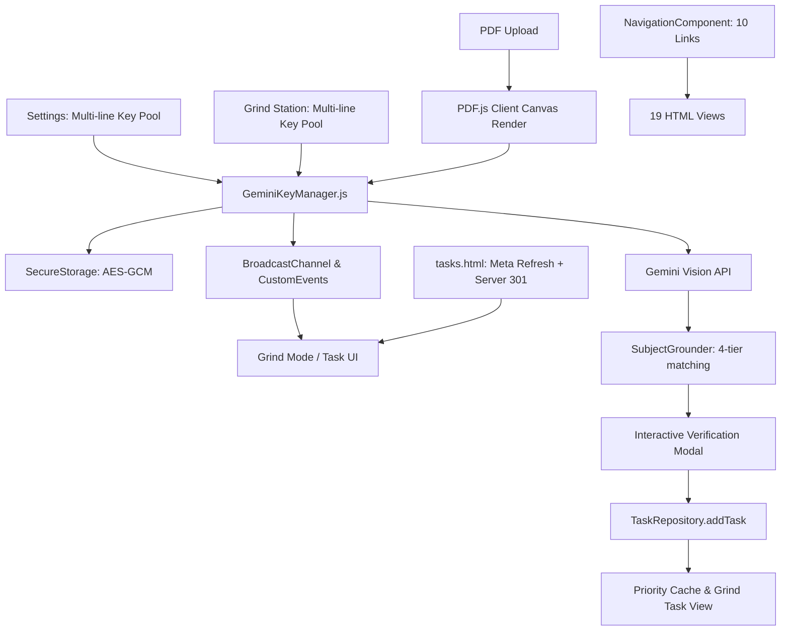

# Project: GPAce Multi-Key Rotation, Navigation Consolidation & Client PDF Task Ingestion

## Architecture
GPAce is a monolithic client-side application (Vanilla JS, HTML5, pure CSS) paired with a lightweight Node.js/Express backend (`server.js` / `server/app.js`).
This project executes three major architectural capabilities:
1. **Unified Gemini Multi-Key Rotation & Failover**: AES-GCM encrypted persistence in `SecureStorage`, multi-line key pool inputs in Settings and Grind Station, sequential round-robin load distribution, automatic immediate failover on HTTP 429 with 60-second cooldown recovery, and cross-tab real-time sync via `BroadcastChannel`.
2. **tasks.html Decommissioning & Navigation Consolidation**: Retirement of `tasks.html` via Express 301 backend redirect and client-side immediate redirect stub, removal of "Tasks" from `CANONICAL_NAV_LINKS` (11 -> 10 canonical links) across all 19 HTML views, updating `header-consistency.test.cjs` and static distribution manifests.
3. **Client-Side PDF Task Ingestion, Grounding & Verification in Grind Mode**: In-browser page-to-canvas rasterization via pinned `pdf.min.js`, multimodal extraction via Gemini Vision with key rotation, 4-tier grounding to user-defined subjects from `SemesterService`, and an interactive verification modal with editable candidate fields before committing to `TaskRepository`.

## Feature Inventory
| # | Feature | Description | Milestone | Source |
|---|---------|-------------|-----------|--------|
| 1 | Multi-line Key Input UI | Multi-line textarea for API keys in Settings and Grind Station with whitespace trimming, deduplication, and regex validation | M1 | survey_gemini_keys_1 |
| 2 | GeminiKeyManager & Rotation | Centralized manager with true round-robin load distribution on successful requests (`getNextKey()`) and SecureStorage AES-GCM persistence | M1 | survey_gemini_keys_1 |
| 3 | HTTP 429 Automatic Failover | Immediate failover to key N+1 on HTTP 429 / RESOURCE_EXHAUSTED with 60s cooldown and zero backoff delay | M1 | survey_gemini_keys_1 |
| 4 | Real-time Multi-Tab Sync | BroadcastChannel('gpace_gemini_keys') and DOM custom events synchronizing key pool and health status across views | M1 | survey_gemini_keys_1 |
| 5 | Outbound AI Sites Integration | Wire imageAnalyzer.js, gemini-api.js, and timetable analysis to use withKeyRotation | M1 | survey_gemini_keys_1 |
| 6 | Canonical Navigation Update | Remove Tasks from NAV_LINKS in NavigationComponent.js (11 -> 10 canonical links) | M2 | survey_tasks_retire_1 |
| 7 | All 19 Views Nav Update | Remove Tasks anchor tag from <nav id="mainNavigation"> across 17 root pages and 2 subdirectories | M2 | survey_tasks_retire_1 |
| 8 | tasks.html Dual Redirection | Express 301 redirect in server/app.js and client-side meta/replace redirect in tasks.html | M2 | survey_tasks_retire_1 |
| 9 | Ancillary Link Updates | Update settings.html:69, todoistIntegration.js, /todoist-callback route, and service-worker | M2 | survey_tasks_retire_1 |
| 10 | Header Test Suite Update | Update header-consistency.test.cjs for 10 links, negative tasks.html assertion, and journeys | M2 | survey_tasks_retire_1 |
| 11 | Client-Side PDF Rasterization | Upload PDF in Grind Mode and render pages to canvas JPEG data URLs via PDF.js in memory | M3 | survey_pdf_vision_1 |
| 12 | Multimodal Vision Extraction | Send rendered canvas page images to Gemini Vision with structured JSON schema using withKeyRotation | M3 | survey_pdf_vision_1 |
| 13 | 4-Tier Subject Grounding | Match parsed subjects against SemesterService.getCurrentSubjects() (exact tag, exact name, token overlap, ungrounded) | M3 | survey_pdf_vision_1 |
| 14 | Interactive Verification Modal | Modal in grind.html displaying candidate tasks with editable inputs, subject mapping, and selection checkboxes (pure CSS) | M3 | survey_pdf_vision_1 |
| 15 | TaskRepository Commitment | Save approved tasks via TaskRepository.addTask and immediately refresh Grind Mode priority tasks | M3 | survey_pdf_vision_1 |
| 16 | Comprehensive E2E Verification | Run full test suite (header-consistency, key-rotation, 20, 33, 41, 47, build-static --check) | M4 | orchestrator_4 |

## Milestones
| # | Name | Scope | Dependencies | Status |
|---|------|-------|-------------|--------|
| M1 | Bulk Gemini API Key Management & Smart Rotation | Features 1, 2, 3, 4, 5 | None | DONE |
| M2 | Decommissioning of tasks.html & Navigation Consolidation | Features 6, 7, 8, 9, 10 | None | DONE |
| M3 | Client-Side PDF Task Ingestion & Subject Grounding | Features 11, 12, 13, 14, 15 | M1, M2 | IN_PROGRESS |
| M4 | Comprehensive E2E Verification & Static Distribution Audit | Feature 16 | M1, M2, M3 | PLANNED |

## Interface Contracts
### GeminiKeyManager ↔ Consumers
- `window.geminiKeyManager.getHealthyKeys()`: returns `Array<{ key: string, inCooldown: boolean }>`
- `window.geminiKeyManager.withKeyRotation(async (apiKey) => { ... })`: executes call with automatic round-robin and immediate 429 failover.
- `window.geminiKeyManager.parseAndSetKeys(rawText)`: sanitizes, trims, deduplicates, and saves key pool to `SecureStorage`.
- Event `'geminiKeysUpdated'`: emitted on `window` and broadcast across `BroadcastChannel('gpace_gemini_keys')`.

### tasks.html ↔ Navigation
- Canonical links: 10 links (`grind.html`, `study-spaces.html`, `daily-calendar.html`, `academic-details.html`, `extracted.html`, `subject-marks.html`, `flashcards.html`, `markdown-converter.html`, `sleep-saboteurs.html`, `settings.html`).
- Direct hit to `tasks.html`: HTTP 301 redirect to `/grind.html` (Express) or client meta refresh / `location.replace('grind.html')` (static).

### PdfTaskExtractor ↔ SubjectGrounder ↔ TaskRepository
- `PdfTaskExtractor.extractTasksFromPdf(file)`: returns `Array<RawParsedTask>`
- `SubjectGrounder.groundTasks(rawTasks)`: returns `Array<CandidateTask>` with `{ ...task, subjectTag, matchedSubject, isGrounded: boolean }`
- `PdfTaskImportController.commitTasks(candidateTasks)`: invokes `TaskRepository.addTask(task.subjectTag, task)` and triggers `_renderPriorityTasks()` in `js/pages/grind.js`.

## Code Layout
- `js/GeminiKeyManager.js`: Centralized key pool, rotation, SecureStorage, and failover engine (owned by M1).
- `settings.html`, `css/settings.css`, `js/settings.js` / `js/pages/settings.js`: Settings Gemini UI (owned by M1).
- `study-spaces.html`, `css/study-spaces.css`, `js/apiSettingsManager.js`: Grind Station Gemini UI (owned by M1).
- `js/components/NavigationComponent.js`: Canonical navigation definition (owned by M2).
- `tasks.html`: Redirect stub (owned by M2).
- `server/app.js`: Backend routes and 301 redirect (owned by M2).
- `tests/cases/header-consistency.test.cjs`: Navigation test assertions (owned by M2).
- `grind.html`, `css/grind.css`, `js/pages/grind.js`: Grind Mode UI & mounting (owned by M3).
- `js/services/PdfTaskExtractor.js`: PDF rendering & Gemini Vision extraction (owned by M3).
- `js/services/SubjectGrounder.js`: Subject matching logic (owned by M3).
- `js/controllers/PdfTaskImportController.js`: Verification modal controller (owned by M3).
